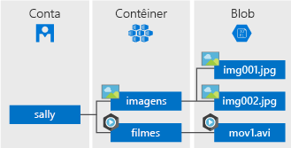

## O que é Armazenamento de Blobs?
A Armazenamento de Blobs do Azure é um serviço para armazenar grandes quantidades de dados de objeto não estruturados, como texto ou dados binários, que podem ser acessados de qualquer lugar do mundo por meio de HTTP ou HTTPS. Você pode usar o armazenamento de Blob para expor dados publicamente para o mundo ou para armazenar dados do aplicativo de forma privada.

Usos comuns de armazenamento de Blob incluem:

* Fornecimento de imagens ou de documentos diretamente a um navegador.
* Armazenamento de arquivos para acesso distribuído.
* Transmissão por streaming de áudio e vídeo.
* Armazenamento de dados de backup e restauração, recuperação de desastres e arquivamento.
* Armazenamento de dados para análise por um serviço local ou hospedado no Azure.

## Conceitos do Serviço Blob
O serviço Blob contém os seguintes componentes:

* **Conta de armazenamento:** todo o acesso ao Armazenamento do Azure é feito por meio de uma conta de armazenamento. Essa conta de armazenamento pode ser uma **conta de armazenamento** de uso geral ou uma **conta de Armazenamento de Blobs**, que é especializada em armazenar objetos ou blobs. Consulte [Sobre as contas de armazenamento do Azure](../articles/storage/common/storage-create-storage-account.md) para obter mais informações.
* **Contêiner:** um contêiner fornece um agrupamento de conjunto de blobs. Todos os blobs devem ter um contêiner. Uma conta pode conter um número ilimitado de contêineres. Um contêiner pode armazenar um número ilimitado de blobs. Observe que o nome do contêiner deve estar em letras minúsculas.
* **Blob:** um arquivo de qualquer tipo e tamanho. O Armazenamento do Azure oferece três tipos de blobs: blobs de block, blobs de acréscimo e blobs de página.
  
    *Blobs de blocos* são ideais para armazenar arquivos de texto ou binários, como documentos e arquivos de mídia. Um blob de blocos único pode conter até 50.000 blocos de até 100 MB cada um, com um tamanho total de pouco mais de 4,75 TB (100 MB X 50.000). 

    *Blobs de anexo* são semelhantes aos blobs de blocos, pois são constituídos de blocos, mas são otimizados para anexas operações. Portanto, são úteis em cenários de registro em log. Um blob de acréscimo único pode conter até 50.000 blocos de até 4 MB cada um, com um tamanho total de pouco mais de 195 GB (4 MB X 50.000).
  
    *Blobs de páginas* podem ter até 1 TB e são mais eficientes para operações frequentes de leitura/gravação. As Máquinas Virtuais do Azure usam blobs de página como sistema operacional e discos de dados.
  
    Para obter detalhes sobre como nomear contêineres e blobs, confira [Nomenclatura e referência de contêineres, blobs e metadados](/rest/api/storageservices/Naming-and-Referencing-Containers--Blobs--and-Metadata).

