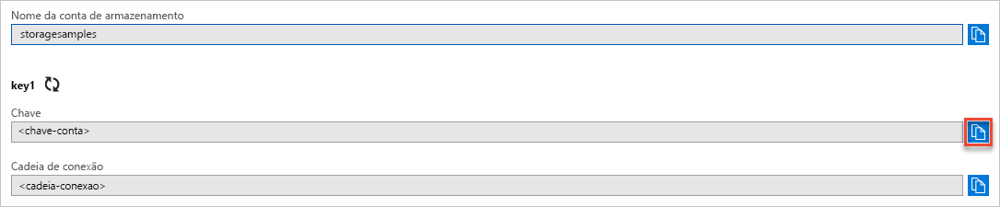

## Copiar suas credenciais no Portal do Azure

O aplicativo de exemplo precisa autenticar o acesso à sua conta de armazenamento. Para autenticar, forneça suas credenciais de conta de armazenamento ao aplicativo na forma de uma cadeia de conexão. Para verificar as credenciais da conta de armazenamento:

1. Navegue até o [Portal do Azure](https://portal.azure.com).
2. Localize sua cadeia de conexão.
3. Na seção **Configurações** da visão geral da conta de armazenamento, selecione **Chaves de acesso**. Suas chaves de acesso da conta são exibidas, bem como a cadeia de conexão completa para cada chave.
4. Anote o nome da sua conta de armazenamento, pois você precisará fornecê-la para autenticar.   
5. Encontre o valor da **Chave** em **key1** e clique no botão **Copiar** para copiar a chave de conta.

    
