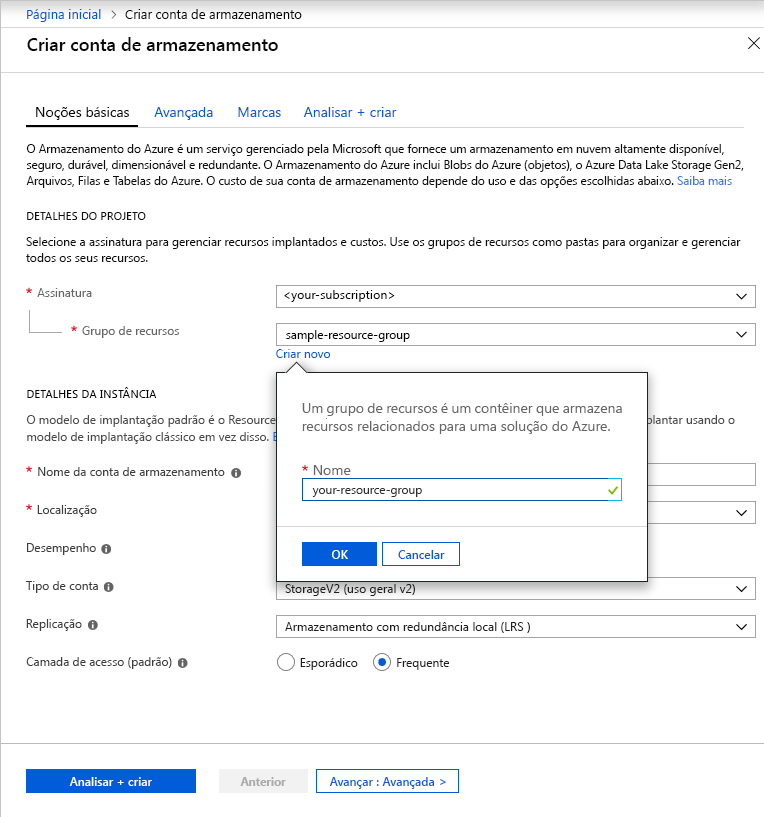

Para criar uma conta de armazenamento de uso geral v2 no portal do Azure, siga estas etapas:

1. No portal do Azure, expanda o menu à esquerda para abrir o menu de serviços e escolha **Todos os serviços**. Em seguida, role para baixo até **Armazenamento** e escolha **Contas de armazenamento**. Na janela **Contas de Armazenamento** que aparece, escolha **Adicionar**.
1. Selecione a assinatura na qual você deseja criar a conta de armazenamento.
1. No campo **Grupo de recursos**, clique em **Criar novo**. Insira um nome para seu novo grupo de recursos, conforme mostrado na imagem a seguir.

    

1. Em seguida, insira um nome para sua conta de armazenamento. O nome escolhido deverá ser único no Azure, deverá ter entre 3 e 24 caracteres e poderá conter somente números e letras minúsculas.
1. Selecione um local para sua conta de armazenamento ou use o local padrão.
1. Deixe esses campos definidos como seus valores padrão:
    - O campo **Modelo de implantação** é definido como **Resource Manager** por padrão.
    - O campo **Desempenho** é definido como **Standard** por padrão.
    - O campo **Tipo de conta** é definido como **StorageV2 (general-purpose v2)** por padrão.
    - O campo **Replicação** definido como **LRS (Armazenamento com redundância local)** por padrão.
    - A **Camada de acesso** é definido como **Frequente** por padrão.

1. Clique em **Revisar + Criar** para examinar as configurações da conta de armazenamento e criar a conta.

Para obter mais informações sobre tipos de contas de armazenamento e outras configurações da conta de armazenamento, confira [Visão geral da conta de armazenamento do Azure](https://docs.microsoft.com/azure/storage/common/storage-account-overview). Para saber mais sobre grupos de recursos, confira [Visão geral do Azure Resource Manager](https://docs.microsoft.com/azure/azure-resource-manager/resource-group-overview). 
