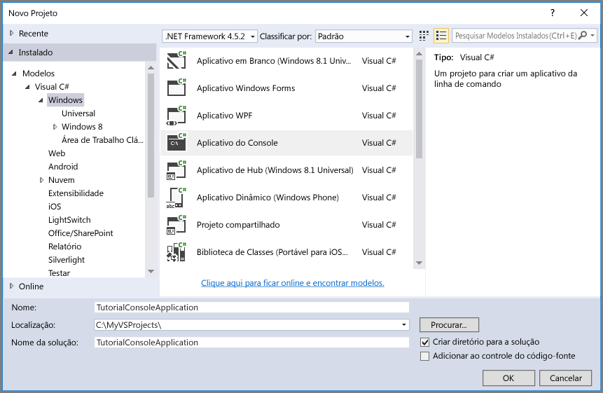

## Configurar seu ambiente de desenvolvimento

Em seguida, configure seu ambiente de desenvolvimento no Visual Studio para que você fique pronto para experimentar os exemplos de código fornecidos neste guia.

### Criar um projeto de aplicativo de console do Windows.

No Visual Studio, crie um novo aplicativo de console do Windows, conforme exibido:

Todos os exemplos de código neste tutorial podem ser adicionados ao método **Main()** em `program.cs` em seu aplicativo de console.

Observe que você pode usar a Biblioteca de Cliente da Armazenamento do Azure a partir de qualquer tipo de aplicativo .NET, incluindo um serviço de nuvem do Azure, um aplicativo Web do Azure, um aplicativo de desktop ou um aplicativo móvel. Neste guia, usamos um aplicativo de console para simplificar.

### Use o NuGet para instalar os pacotes necessários

Há dois pacotes que você precisará instalar em seu projeto para concluir este tutorial:

- [Biblioteca de Cliente de Armazenamento do Microsoft Azure para .NET](https://www.nuget.org/packages/WindowsAzure.Storage/): este pacote fornece acesso programático aos recursos de dados em sua conta de armazenamento.
- [Biblioteca do Gerenciador de Configuração do Microsoft Azure para .NET](https://www.nuget.org/packages/Microsoft.WindowsAzure.ConfigurationManager/): este pacote fornece uma classe para analisar uma cadeia de conexão de um arquivo de configuração, independentemente de onde o aplicativo está sendo executado.

Você pode usar NuGet para obter os dois pacotes. Siga estas etapas:

1. Clique com o botão direito do mouse no **Gerenciador de Soluções** e escolha **Gerenciar Pacotes NuGet**.
2. Pesquise online por "Windowsazure.Storage" e clique em **Instalar** para instalar a Biblioteca de Cliente de Armazenamento e suas dependências.
3. Pesquise online por "ConfigurationManager" e clique em **Instalar** para instalar o Gerenciador de Configuração do Azure.

>[AZURE.NOTE] O pacote de Biblioteca de Cliente do Armazenamento também está incluído no [SDK do Azure para .NET](https://azure.microsoft.com/downloads/). No entanto, também recomendamos a instalação da Biblioteca de Cliente de Armazenamento do NuGet para garantir que você tenha sempre a versão mais recente da biblioteca do cliente.

### Determinar o ambiente de destino

Você tem duas opções de ambiente para executar os exemplos neste guia:

- Você pode executar o código em uma conta de Armazenamento do Azure na nuvem. 
- Você pode executar o código em um emulador de armazenamento do Azure. O emulador de armazenamento é um ambiente local que emula uma conta de Armazenamento do Azure na nuvem. O emulador é uma opção gratuita para testar e depurar seu código enquanto o aplicativo está em desenvolvimento. O emulador usa uma conta e chave bem conhecidas. Para mais detalhes, confira [Usar o emulador de Armazenamento do Azure para desenvolvimento e teste](../articles/storage/storage-use-emulator.md)

Se você estiver selecionando uma conta de armazenamento na nuvem, copie a chave de acesso primário para sua conta de armazenamento a partir do Portal do Azure. Para saber mais, confira [Exibir e copiar chaves de acesso de armazenamento](../articles/storage/storage-create-storage-account.md#view-and-copy-storage-access-keys).

> [AZURE.NOTE] Você pode utilizar o emulador de armazenamento como destino para evitar quaisquer custos associados ao Armazenamento do Azure. Todavia, se você escolher utilizar como destino uma conta de armazenamento do Azure na nuvem, os custos para realização das operações neste tutorial serão insignificantes.

### Configurar a cadeia de conexão de armazenamento

A Biblioteca de Cliente de Armazenamento do Azure para .NET oferece suporte ao uso de uma cadeia de conexão de armazenamento para configurar pontos de extremidade e credenciais para acesso a serviços de armazenamento. A melhor maneira de manter a cadeia de conexão de armazenamento é em um arquivo de configuração.

Para obter mais detalhes sobre as sequências de conexão, veja [Configurar uma cadeia de conexão para o Armazenamento do Azure](../articles/storage/storage-configure-connection-string.md).

> [AZURE.NOTE] Sua chave de conta de armazenamento é semelhante para a senha raiz da sua conta de armazenamento. Sempre tenha cuidado para proteger a chave de sua conta de armazenamento. Evite distribuí-la a outros usuários, embuti-la no código ou salvá-lo em um arquivo de texto sem formatação que esteja acessível a outras pessoas. Regenere a chave usando o Portal do Azure se você achar que ela pode ter sido comprometida.

Para configurar a cadeia de conexão, abra o arquivo `app.config` do Gerenciador de Soluções no Visual Studio. Adicionar o conteúdo do elemento `<appSettings>` mostrado abaixo. Substitua `account-name` pelo nome da sua conta de armazenamento e `account-key` pela chave de acesso da conta:

	<configuration>
	    <startup> 
	        <supportedRuntime version="v4.0" sku=".NETFramework,Version=v4.5.2" />
	    </startup>
  		<appSettings>
    		<add key="StorageConnectionString" value="DefaultEndpointsProtocol=https;AccountName=account-name;AccountKey=account-key" />
  		</appSettings>
	</configuration>

Por exemplo, a configuração será semelhante a:

	<add key="StorageConnectionString" value="DefaultEndpointsProtocol=https;AccountName=storagesample;AccountKey=nYV0gln6fT7mvY+rxu2iWAEyzPKITGkhM88J8HUoyofvK7C6fHcZc2kRZp6cKgYRUM74lHI84L50Iau1+9hPjB==" />

Para direcionar o emulador de armazenamento, você pode usar um atalho que mapeia para o nome de conta e chave bem conhecidos. Nesse caso, a configuração da cadeia de conexão será:

	<add key="StorageConnectionString" value="UseDevelopmentStorage=true;" />

<!---HONumber=AcomDC_0420_2016-->