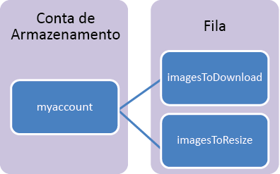

## O que é armazenamento de fila?

O armazenamento de filas do Azure é um serviço para armazenamento de um grande número de mensagens que podem ser acessadas de qualquer lugar do mundo por meio de chamadas autenticadas usando HTTP ou HTTPS. Uma única mensagem de fila pode ter até 64 KB de tamanho e uma fila pode conter milhões de mensagens, até o limite de capacidade total de uma conta de armazenamento.

Usos comuns de Armazenamento de filas incluem:

-   Criar uma lista de pendências de trabalho para processar de maneira assíncrona
-   Transmitir mensagens de uma função Web do Azure para uma função de Trabalho do Azure

## Conceitos do Serviço da Fila

O serviço Fila contém os seguintes componentes:

- **Formato da URL:** as filas são acessadas usando o seguinte formato de URL: http://`<storage account>`.queue.core.windows.net/`<queue>' 
      
	A URL a seguir endereça um fila no diagrama:
		
		http://myaccount.queue.core.windows.net/images-to-download

- **Conta de Armazenamento:** todo o acesso ao Armazenamento do Azure é feito através de uma conta de armazenamento. Consulte [Escalabilidade e Metas de Desempenho do Armazenamento do Azure](../articles/storage/storage-scalability-targets.md) para obter detalhes sobre a capacidade da conta de armazenamento.

- **Fila:** uma fila contém um conjunto de mensagens. Todas as mensagens devem estar em uma fila. Observe que o nome da fila deve estar em letras minúsculas. Para saber mais sobre filas de nomenclatura, confira [Nomenclatura de filas e metadados](https://msdn.microsoft.com/library/azure/dd179349.aspx).

- **Mensagem:** uma mensagem, em qualquer formato, de até 64 KB. O tempo máximo que uma mensagem pode ficar na fila é de sete dias.
