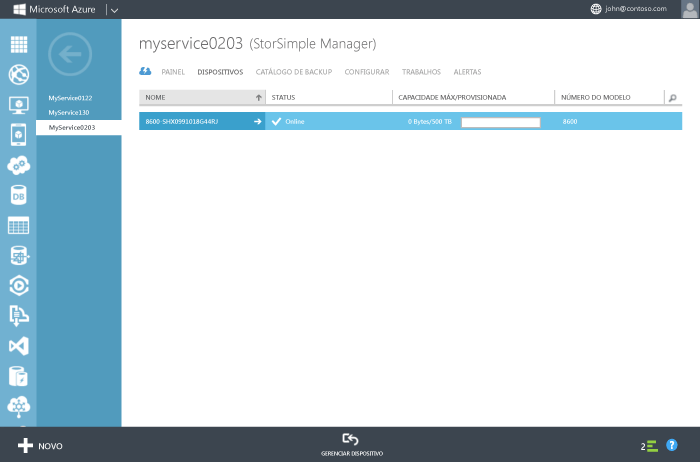

### Para configurar e registrar o dispositivo

1. Acesse a interface do Windows PowerShell no console serial do dispositivo StorSimple. Consulte [Usar o PuTTY para se conectar ao console serial do dispositivo](#use-putty-to-connect-to-the-device-serial-console) para obter instruções. **Siga o procedimento corretamente ou você não conseguirá acessar o console.**

2. Na sessão que é aberta, pressione Enter uma vez para obter um prompt de comando.

3. Você deverá escolher o idioma que deseja definir para seu dispositivo. Especifique o idioma e pressione Enter.

    

4. No menu do console serial apresentado, escolha a opção 1 para efetuar logon com acesso completo.

    
  
     Conclua as etapas de 5 a 12 para definir as configurações de rede necessárias e mínimas para seu dispositivo. **Essas etapas de configuração devem ser executadas no controlador ativo do dispositivo.** O menu do console serial indica o estado do controlador na mensagem de faixa. Se você não estiver conectado ao controlador ativo, desconecte e conecte-se ao controlador ativo.

5. No prompt de comando, digite sua senha. A senha do dispositivo padrão é **Senha1**.

6. Digite o seguinte comando: `Invoke-HcsSetupWizard`.

7. Um assistente de instalação aparecerá para ajudá-lo a configurar as definições da rede para o dispositivo. Forneça as seguintes informações:
   - Endereço IP para a interface de rede DADOS 0
   - Máscara da sub-rede
   - Gateway
   - Endereço IP do servidor DNS Primário
    
		Note that the system is validating network settings after each step in the process.
   
      >[AZURE.NOTE]Você terá que aguardar alguns minutos para que a máscara da sub-rede e as configurações de DNS sejam aplicadas. Se você receber a mensagem de erro "Verificar a conectividade de rede com Dados 0", verifique a conexão de rede física na interface de rede DADOS 0 de seu controlador ativo.

8. (Opcional) configure seu servidor proxy da Web. Embora a configuração do proxy da Web seja opcional, **saiba que se você usar um proxy da Web, poderá apenas configurá-lo aqui**. Para obter mais informações, visite [Configurar proxy da Web para seu dispositivo](https://msdn.microsoft.com/library/azure/dn764937.aspx).

9. Configure um servidor NTP primário para seu dispositivo. Os servidores NTP são necessários, pois seu dispositivo deve sincronizar a hora para que ele possa se autenticar com seus provedores de serviço de nuvem. Verifique se sua rede permite que o tráfego NTP passe do data center para a Internet. Se isso não for possível, especifique um servidor NTP interno.
 
10. Por motivos de segurança, a senha de administrador do dispositivo expira após a primeira sessão, e você precisará alterá-la agora. Quando solicitado, forneça uma senha de administrador do dispositivo. Uma senha de administrador do dispositivo válida deve ter entre 8 e 15 caracteres. A senha deve conter três das seguintes opções: caracteres com letras minúsculas e maiúsculas, numéricos e especiais.

	 

11. A etapa final do assistente de instalação registra seu dispositivo no serviço Gerenciador StorSimple. Para isso, será necessária a chave de registro do serviço obtida na etapa 2. Depois de fornecer a chave de registro, talvez seja necessário aguardar de 2 a 3 minutos antes do dispositivo ser registrado.

      >[AZURE.NOTE]Você pode pressionar Ctrl + C a qualquer momento para sair do assistente de instalação. Se você tiver inserido todas as configurações de rede (endereço IP para Dados 0, Máscara de sub-rede e Gateway), as entradas serão mantidas.

	

12. Depois do dispositivo ser registrado, uma chave de Criptografia de Dados do Serviço será exibida. Copie essa chave e salve-a em um local seguro. **Essa chave será necessária com a chave de registro do serviço para registrar dispositivos adicionais no serviço Gerenciador StorSimple.** Consulte a [segurança do StorSimple](../articles/storsimple/storsimple-security.md) para obter mais informações sobre essa chave.
	
	

      >[AZURE.NOTE]Para copiar o texto da janela do console serial, basta selecionar o texto. Então, você conseguirá colá-lo na área de transferência ou em qualquer editor de texto. NÃO use Ctrl + C para copiar a chave de criptografia de dados do serviço. Usar Ctrl + C fará com que você saia do assistente de instalação. Como resultado, a senha de administrador do dispositivo não será alterada, e o dispositivo voltará para a senha padrão.

13. Saia do console serial.

14. Volte para o Portal de Gerenciamento e conclua as seguintes etapas:
  1. Clique duas vezes no serviço Gerenciador StorSimple para acessar a página**Início Rápido**.
  2. Clique em **Exibir dispositivos conectados**.
  3. Na página **Dispositivos**, verifique se o dispositivo conectou com êxito o serviço pesquisando o status. O status do dispositivo deve ser **Online**.
   
    	 
  
        If the device status is **Offline**, wait for a couple of minutes for the device to come online. 
      
        If the device is still offline after a few minutes, then you need to make sure that your firewall network was configured as described in the [network requirements for your StorSimple device](https://msdn.microsoft.com/library/dn772371.aspx). If you do not have HTTP 1.1 support, check port 9354 to make sure that it is open for outbound communication. This port is used for communication between the StorSimple Manager service and your StorSimple device.
     
       

<!---HONumber=August15_HO6-->