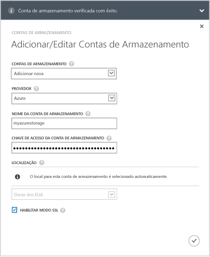
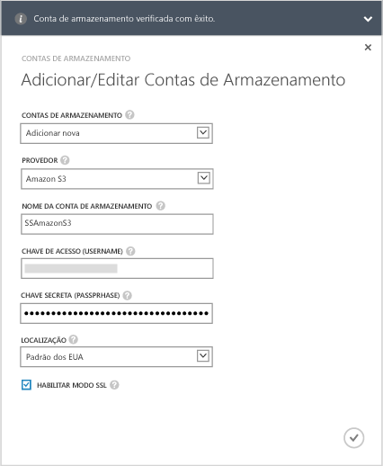
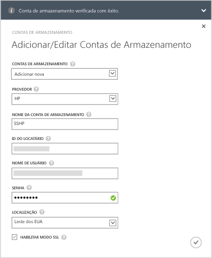
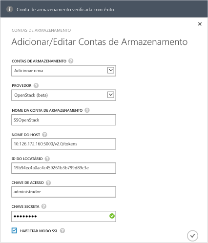

<properties 
   pageTitle="Opcional: configurar uma nova conta de armazenamento para o serviço"
   description="Explica como configurar uma conta de armazenamento para o serviço StorSimple Manager executando a Atualização 1."
   services="storsimple"
   documentationCenter="NA"
   authors="alkohli"
   manager="adinah"
   editor="tysonn" />
<tags 
   ms.service="storsimple"
   ms.devlang="NA"
   ms.topic="article"
   ms.tgt_pltfrm="NA"
   ms.workload="TBD"
   ms.date="05/18/2015"
   ms.author="alkohli" />

#### Para adicionar uma conta de armazenamento no StorSimple 8000 Series Atualização 1.0

1. Na página inicial do serviço StorSimple Manager, selecione seu serviço e clique duas vezes nele. Isso o levará para a página de **Início Rápido**. Selecione a página **Configurar**.

2. Clique em **Adicionar/editar conta de armazenamento**.

3. Na caixa de diálogo **Adicionar/Editar Conta de Armazenamento**, clique em **Adicionar nova**.

4. No campo **Provedor**, selecione o provedor de serviços de nuvem apropriado. Os provedores com suporte são Azure, Amazon S3, Amazon S3 com RRS, HP e OpenStack. Especifique as credenciais e o local associados à conta de armazenamento de seus provedores de serviço de nuvem. Os campos apresentados para credenciais serão diferentes de acordo com o provedor de serviços de nuvem que você tiver especificado.
  - Se você tiver selecionado o Azure como seu provedor de serviços de nuvem, forneça o **Nome** e a **Chave de Acesso** primária para sua conta de armazenamento do Microsoft Azure. Para uma conta do Azure, o local será populado automaticamente.

        

 - Se você tiver selecionado Amazon S3 ou Amazon S3 com RRS, forneça um **Nome de Conta de Armazenamento** amigável, uma **Chave de Acesso** e uma **Chave Secreta**. Para Amazon S3 e Amazon S3 com RRS, há suporte aos seguintes locais:

		- US Standard
		- US West (Oregon)
		- US West (Northern California)
		- EU (Ireland)
		- Asia Pacific (Singapore)
		- Asia Pacific (Sydney)
		- Asia Pacific (Tokyo)
		- South America (Sao Paulo)

        
	  		
 - Se você tiver selecionado HP como seu provedor de serviços de nuvem, forneça um **Nome de Conta de Armazenamento** amigável, uma **ID de Locatário**, um **Nome de Usuário** e uma **Senha**. Para HP, há suporte aos seguintes locais:

		- US East
		- US West
	  
        
	  		
 - Se você tiver selecionado **Openstack** como seu provedor de serviços de nuvem, forneça um **Nome de Host**, uma **Chave de Acesso** e uma **Chave Secreta**.

        > [AZURE.NOTE] For all the cloud service providers, excluding Azure, a friendly name is allowed. You can use different friendly names and create more than one storage account with the same set of credentials.

        

5. Selecione **Habilitar modo SSL** para criar um canal seguro para comunicação de rede entre o dispositivo e a nuvem. Desmarcar a caixa de seleção **Habilitar modo SSL** somente se você estiver operando em uma nuvem privada.

      >[AZURE.NOTE]Se você estiver usando o HP como seu provedor, SSL sempre estará habilitado.
  		
6. Clique no ícone de verificação . Você será notificado depois que a conta de armazenamento tiver sido criada com êxito.

7. A conta de armazenamento recém-criada será exibida na página **Configurar** em **Contas de armazenamento**. Clique em **Salvar** para salvar a nova conta de armazenamento. Clique em **OK** quando solicitado para confirmar.

<!---HONumber=July15_HO2-->