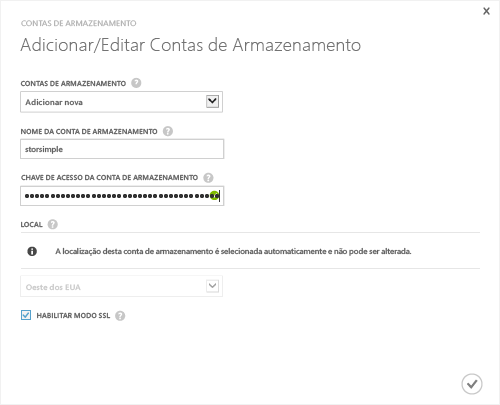

#### Para adicionar uma nova conta de armazenamento na versão de lançamento do StorSimple (GA)

1. Na página inicial do serviço StorSimple Manager, selecione seu serviço e clique duas vezes nele. Isso o levará para a página de **Início Rápido**. Selecione a página **Configurar**.

2. Clique em **Adicionar/Editar conta de armazenamento**.

3. Na caixa de dialogo **Adicionar/Editar conta de armazenamento**, faça o seguinte:

  1. Clique em **Adicionar nova**.
  2. Forneça um nome para sua conta de armazenamento.
  3. Forneça a **Chave de Acesso** primária para sua conta de armazenamento do Microsoft Azure.
  4. Selecione **Habilitar modo SSL** para criar um canal seguro para comunicação de rede entre o dispositivo e a nuvem. Desmarcar a caixa de seleção **Habilitar modo SSL** somente se você estiver operando em uma nuvem privada.
  5. Clique no ícone de verificação . Você será notificado depois que a conta de armazenamento tiver sido criada com êxito.

    

4. A conta de armazenamento recém-criada será exibida na página **Configurar** em **Contas de armazenamento**. Clique em **Salvar** para salvar a conta de armazenamento recém-criada. Clique em **OK** quando solicitado para confirmar.

<!---HONumber=July15_HO4-->