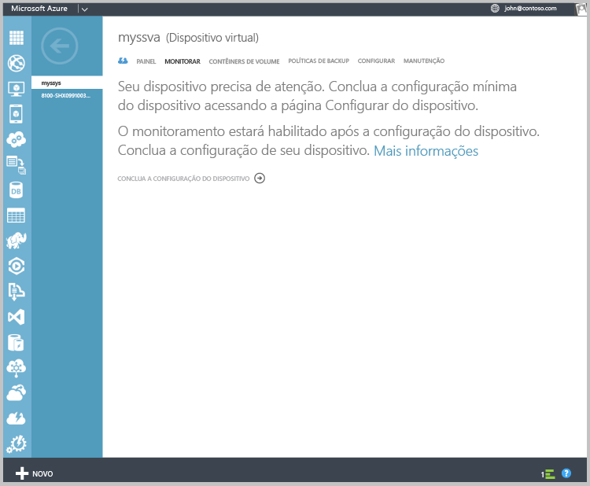
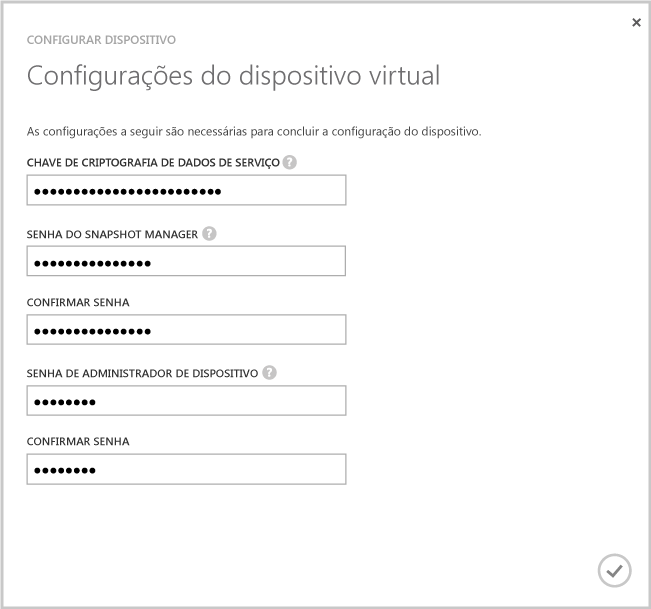
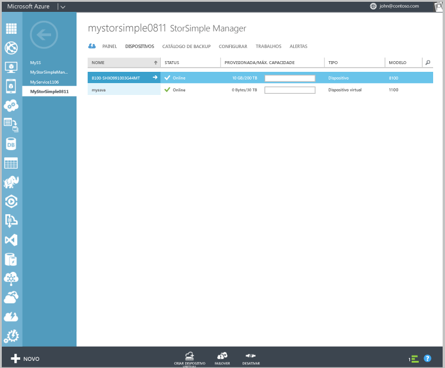

<!---author: alkohli, last updated: 11/05/2015 --->

#### Para configurar e registrar o dispositivo virtual
1. Selecione o dispositivo virtual StorSimple que você acabou de criar na página **Dispositivos**. 
2. Clique em **concluir a instalação do dispositivo**. Isso inicia o assistente Configurar dispositivo.
   
    
3. Insira a **Chave de Criptografia de Dados de Serviço** no espaço fornecido.
4. Insira as senhas do Snapshot Manager e do Administrador do Dispositivo com o comprimento e as configurações especificadas.
5. Clique na marca de seleção para concluir a configuração inicial e o registro do dispositivo virtual.
   
    

Depois que a configuração e o registro forem concluídos, o dispositivo ficará online. (Pode levar vários minutos para que o dispositivo fique online.)

<!---HONumber=AcomDC_1217_2015-->