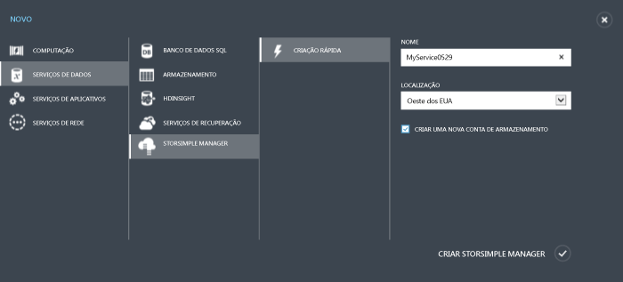
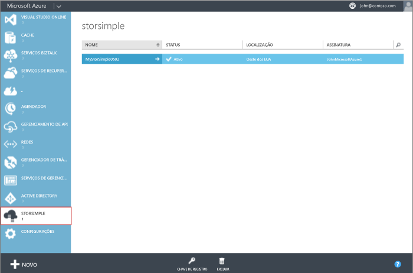

#### Para criar um novo serviço

1. Usando suas credenciais de conta da Microsoft, faça logon no Portal de Gerenciamento na seguinte URL: [http://azure.microsoft.com/](http://azure.microsoft.com/).

2. No Portal de Gerenciamento, clique em **Novo** > **Serviços de Dados** > **StorSimple Manager** > **Criação Rápida**.

3. No formulário exibido, faça o seguinte:
  1. Fornecer um **Nome** exclusivo para o serviço. Este é um nome amigável que pode ser usado para identificar o serviço. O nome pode ter entre 2 e 50 caracteres que podem ser letras, números e hífens. O nome deve começar e terminar com uma letra ou um número.
  2. Fornecer um **Local** para o serviço. Em geral, escolha um local próximo à região geográfica onde quer implantar os seus serviços. Você talvez queira considerar o seguinte: 
	 
		- Se você tiver cargas de trabalho existentes no Azure que também planeja implantar com seu dispositivo StorSimple, use aquele datacenter.
		- Seu serviço StorSimple Manager e o Armazenamento do Azure podem estar em dois locais separados. Nesse caso, é necessário criar a conta de armazenamento do Azure e do StorSimple Manager separadamente. Para criar uma conta de armazenamento do Azure, acesse o serviço Armazenamento do Azure no Portal de Gerenciamento e siga as etapas em [Criar uma conta de Armazenamento do Azure](storage-create-storage-account.md#create-a-storage-account). Após criar essa conta, adicione-a ao serviço StorSimple Manager seguindo as etapas em [Configurar uma nova conta de armazenamento para o serviço](storsimple-deployment-walkthrough.md#configure-a-new-storage-account-for-the-service).
		 
  3. Escolha uma **Assinatura** na lista suspensa. A assinatura está vinculada à sua conta de cobrança. Este campo não estará presente se você tiver apenas uma assinatura.
  4. Selecione **Criar uma nova conta de armazenamento** para criar automaticamente uma conta de armazenamento com o serviço. Esta conta de armazenamento terá um nome especial, como "storsimplebwv8c6dcnf". Se você precisar de seus dados em um local diferente, desmarque essa caixa. 
  5. Clique em **Criar StorSimple Manager** para criar o serviço.

   

  Você será direcionado para a página inicial **Serviço**. A criação do serviço levará alguns minutos. Depois que o serviço foi criado com êxito, você será notificado adequadamente e o status do serviço será alterado para **Ativo**.
 
   

<!---HONumber=August15_HO8-->