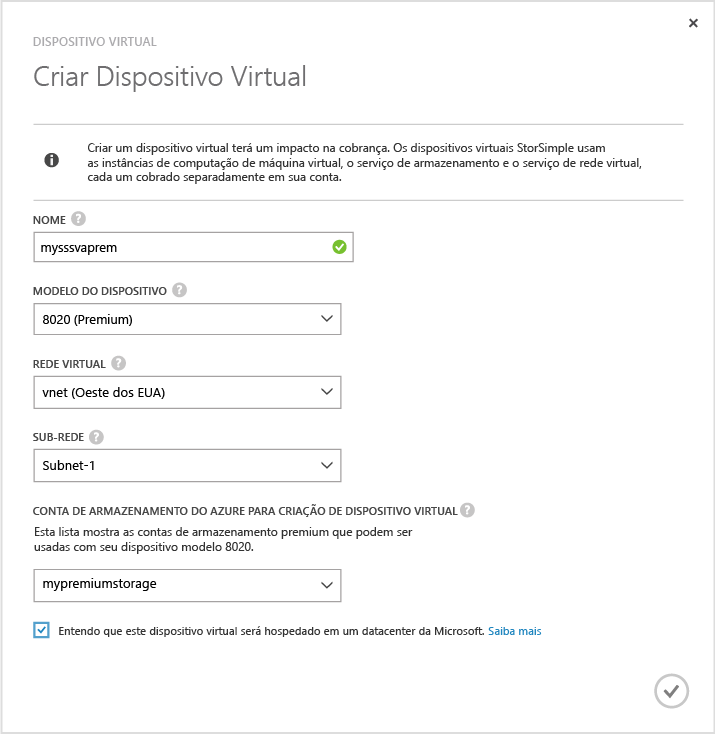
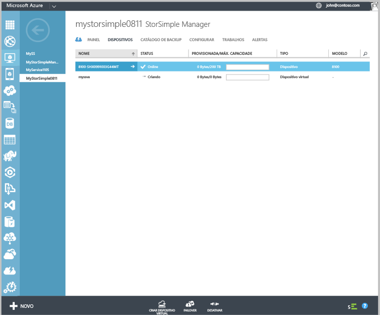

#### Para criar um dispositivo virtual
1. No portal do Azure, vá até o serviço **StorSimple Manager** .
2. Vá para a página **Dispositivos** . Clique em **Criar dispositivo virtual** na parte inferior da página **Dispositivos**.
3. Na caixa de diálogo **Criar Dispositivo Virtual**, especifique os detalhes a seguir.
   
     
   
   1. **Nome** – um nome exclusivo para seu dispositivo virtual.
   2. **Modelo** – escolha o modelo do dispositivo virtual. Este campo só será exibido se você estiver executando a Atualização 2 ou posterior. Um modelo de dispositivo 8010 oferece 30 TB de armazenamento padrão enquanto 8020 tem 64 TB de armazenamento Premium. Especificar 8010
   3. para implantar cenários de recuperação de nível de item de backups. Selecione 8020 para implantar cargas de trabalho de baixa latência e alto desempenho, ou usado como um dispositivo secundário para recuperação de desastre.
   4. **Versão** – escolha a versão do dispositivo virtual. Se um modelo de dispositivo de 8020 estiver selecionado, o campo de versão não será apresentado ao usuário. Esta opção não estará disponível se todos os dispositivos físicos registrados com esse serviço estiverem executando Atualização 1 (ou posterior). Esse campo só será exibido se você tiver uma combinação de dispositivos físicos pré-atualização 1 e Atualização 1 registrados com o serviço. A versão do dispositivo virtual determinará em qual dispositivo físico você pode aplicar o failover ou clonar. É importante que você crie uma versão apropriada do dispositivo virtual. Selecione:
      
      * Atualização 0.3 da versão, se você for realizar o failover ou DR de um dispositivo físico executando a Atualização 0.3 ou anterior. 
      * Atualização 1 da versão, se você for realizar o failover ou clonagem de um dispositivo físico executando a Atualização 1 (ou posterior). 
   5. **Rede virtual** – Especifique uma rede virtual que deseja usar com este dispositivo virtual. Se usar o armazenamento Premium (Atualização 2 ou posterior), você deve selecionar uma rede virtual com suporte com a conta de Armazenamento Premium. As redes virtuais sem suporte serão desabilitadas na lista suspensa. Você será avisado se você selecionar uma rede virtual sem suporte. 
   6. **Conta de armazenamento para criação de dispositivo virtual** – Selecione uma conta de armazenamento para manter a imagem do dispositivo virtual durante o provisionamento. Esta conta de armazenamento deve estar na mesma região do dispositivo virtual e da rede virtual. Ela não deve ser usada para armazenamento de dados do dispositivo virtual. Por padrão, uma nova conta de armazenamento será criada para essa finalidade. No entanto, se você souber que você já tem uma conta de armazenamento adequada para esse uso, poderá selecioná-la da lista. Se você criar um dispositivo virtual premium, a lista suspensa exibirá apenas contas de armazenamento Premium. 
      
      > [!NOTE]
      > O dispositivo virtual só pode trabalhar com as contas de armazenamento do Azure. Outros provedores de serviços de nuvem, como a Amazon, HP e OpenStack (que têm suporte para o dispositivo físico) não têm suporte para o dispositivo virtual StorSimple.
      > 
      > 
   7. Clique na marca de seleção para indicar que você entende que os dados armazenados no dispositivo virtual serão hospedados em um datacenter da Microsoft. Quando você usa apenas um dispositivo físico, sua chave de criptografia é mantida com seu dispositivo; portanto, a Microsoft não pode descriptografá-la. 
      
       Quando você usa um dispositivo virtual, a chave de criptografia e a chave de descriptografia são armazenadas no Microsoft Azure. Para saber mais, consulte [Considerações de segurança para usar um dispositivo virtual](../articles/storsimple/storsimple-security.md#storsimple-virtual-device-security).
   8. Clique no ícone de seleção para criar o dispositivo virtual. O dispositivo pode levar cerca de 30 minutos para ser provisionado.
      
      

<!--HONumber=Nov16_HO2-->

