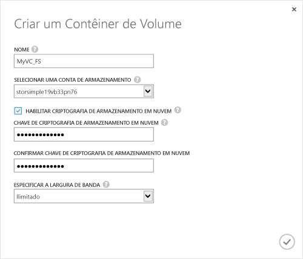

#### Para criar um contêiner de volume

1. Na página **Início Rápido** do dispositivo clique em **Adicionar um contêiner de volume**. A caixa de diálogo **Criar Contêiner de Volume** é exibida.

    

2. Na caixa de diálogo **Criar Contêiner de Volume**:
  1. Fornecer um **Nome** para o seu contêiner do volume. O nome deve ter entre 3 a 32 caracteres.
  2. Selecione uma **Conta de Armazenamento** para associar a esse contêiner de volume. Você pode escolher a conta padrão que é gerada no momento da criação do serviço. Você também pode usar a opção **Adicionar novo** para especificar uma conta de armazenamento que não está vinculada a essa assinatura de serviço.
  3. Selecione **Habilitar Criptografia de Armazenamento em Nuvem** para habilitar a criptografia dos dados enviados do dispositivo para a nuvem.
  4. Forneça e confirme uma **Chave de Criptografia de Armazenamento em Nuvem** que possui entre 8 a 32 caracteres. Essa chave é usada pelo dispositivo para acessar dados criptografados.
  5. Selecione **Ilimitada** na lista suspensa **Especificar largura de banda** se desejar consumir toda a largura de banda disponível. Você também pode definir essa opção para **Personalizada** para empregar os controles de largura de banda, e especifique um valor entre 1 e 1.000 Mbps. Se você tiver informações de uso da largura de banda disponíveis, você poderá alocar a largura de banda com base em uma agenda especificando **Selecionar um modelo de largura de banda**. Para obter um procedimento passo a passo, vá para [Adicionar um modelo de largura de banda](https://msdn.microsoft.com/library/dn757746.aspx#addBT).
  6. Clique no ícone de verificação  para salvar esse contêiner de volume e sair do assistente. 

  O contêiner de volume recém-criado será listado na página **Contêineres de volume**.

<!---HONumber=August15_HO6-->