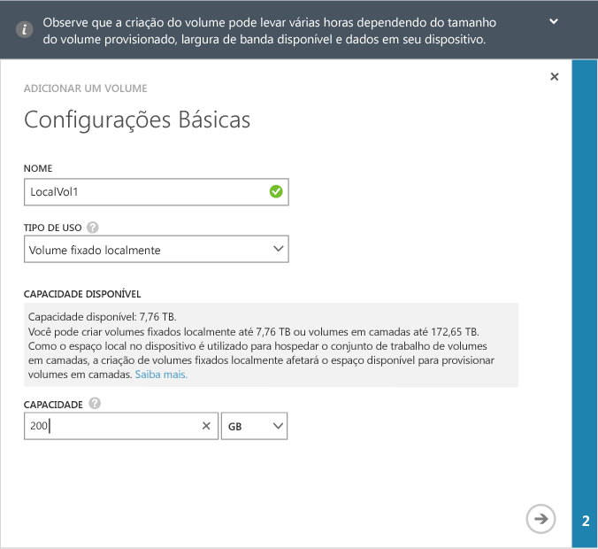
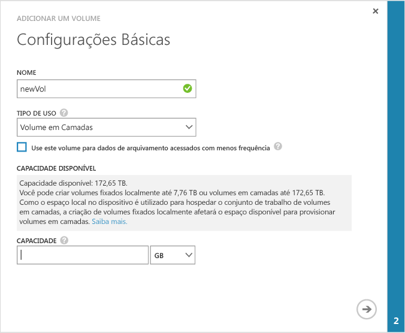
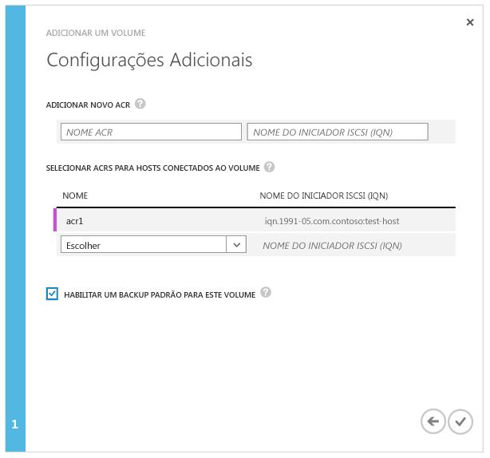

<!--author=SharS last changed: 02/04/2016-->

#### Para criar um volume

1. No página **Início Rápido** do dispositivo clique em **Adicionar um volume**. Isso inicia o assistente Adicionar um volume.

2. No assistente Adicionar um volume, em **Configurações Básicas**:

	4. Digite uma **Nome** para o seu volume.
	5. Na lista suspensa, selecione o **Tipo de Uso** para o seu volume. Para cargas de trabalho que exigem garantias locais, menos latências e um melhor desempenho, selecione um volume **Fixado localmente**. Para todos os outros dados, selecione um volume **Em camadas**. Se estiver usando esse volume para dados de arquivamento, marque **Usar este volume para dados de arquivamento acessados com menos frequência**. 
	
		Um volume fixado localmente é provisionado estaticamente e garante que os dados primários no volume permanecem como locais para o dispositivo e não são divulgados na nuvem. Se você criar um volume fixado localmente, o dispositivo verificará o espaço disponível nas camadas locais para provisionar o volume do tamanho solicitado. A operação de criação de um volume fixado localmente pode envolver a perda de dados existentes do dispositivo para a nuvem e o tempo necessário para criar o volume pode ser longo. O tempo total depende do tamanho do volume provisionado, da largura de banda disponível e dos dados no dispositivo.

		Um volume em camadas é provisionado por completo e pode ser criado bem rapidamente. Se você estiver usando o volume em camadas para dados de arquivamento, a seleção de **Usar este volume para dados de arquivamento acessados com menos frequência** altera o tamanho do bloco de eliminação de duplicação para o volume para 512 KB. Se esse campo não estiver marcado, o volume em camadas correspondente usará um tamanho de bloco de 64 KB. Um tamanho maior de bloco de eliminação de duplicação permite que o dispositivo acelere a transferência de dados de arquivo grandes para a nuvem.

	3. Especifique o **Capacidade Provisionada** para o seu volume. Anote a capacidade disponível com base no tipo de volume selecionado. O tamanho do volume especificado não deve exceder o espaço disponível.

		É possível provisionar volumes fixados localmente de até 9 TB ou volumes em camadas de até 200 TB no dispositivo 8100. No dispositivo 8600 maior, é possível provisionar volumes fixados localmente de até 24 TB ou volumes em camadas de até 500 TB. Como o espaço local no dispositivo é necessário para hospedar o conjunto de trabalho de volumes em camadas, a criação de volumes fixados localmente afetará o espaço disponível para o provisionamento de volumes em camadas. Portanto, se você criar um volume fixado localmente, o espaço disponível para a criação de volumes em camadas será reduzido. Da mesma forma, se um volume em camadas é criado, o espaço disponível para a criação de volumes localmente fixados será reduzido.

		Se você provisionar um volume fixado localmente de 9 TB (tamanho máximo permitido) em seu dispositivo 8100, você esgotará todo o espaço local disponível no dispositivo. Você não poderá criar um volume em camadas desse ponto em diante, pois não há espaço local no dispositivo para hospedar o conjunto de trabalho do volume em camadas. Os volumes existentes em camadas também afetam o espaço disponível. Por exemplo, se você tiver um dispositivo 8100 que já tem volumes em camadas de 100 TB, somente 4,5 TB de espaço estará disponível para volumes fixados localmente.

        A imagem a seguir mostra a caixa de diálogo **Configurações Básicas** para um volume fixo local.

         

        A imagem a seguir mostra a caixa de diálogo **Configurações Básicas** para um volume em camadas.

         

   4. Clique no ícone de seta  para ir para a próxima página.

3. Na caixa de diálogo **Configurações Adicionais**, adicione um novo registro de controle de acesso (ACR):

	1. Dê um **Nome** para o seu ACR.
	2. Em **Nome do Iniciador iSCSI**, forneça o iSCSI IQN (nome qualificado) do host Windows. Se você não tiver o IQN, vá para [Obter o IQN de um host do Windows Server](#get-the-iqn-of-a-windows-server-host).
	3. Em **Backup padrão para este volume?**, selecione a caixa de seleção **Habilitar**. O backup padrão criará uma política que é executa às 22:30 todos os dias (hora do dispositivo) e cria um instantâneo de nuvem desse volume.
	 
     > [AZURE.NOTE] Depois que o backup está habilitado aqui, ele não pode ser revertido. Você precisará editar o volume para modificar essa configuração.

     

4. Clique no ícone de verificação . Será criado um volume com as configurações especificadas.

<!---HONumber=AcomDC_0211_2016-->