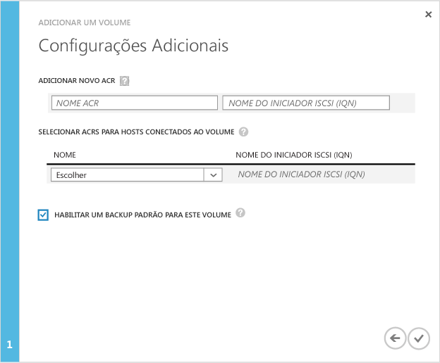

<!--author=SharS last changed: 11/18/15-->

#### Para criar um volume

1. No página **Início Rápido** do dispositivo clique em **Adicionar um volume**. Isso inicia o assistente Adicionar um volume.

2. No assistente Adicionar um volume, em **Configurações Básicas**, faça o seguinte:
   1. Digite um **Nome** para o seu volume.
   2. Especifique a **Capacidade Provisionada** para o seu volume em GB ou TB. A capacidade de volume deve ficar entre 1 GB e 64 TB para um dispositivo físico.
   3. Na lista suspensa, selecione o **Tipo de Uso** para o seu volume. Se você estiver usando esse volume de dados de arquivamento, marque a caixa de seleção **Usar este volume para dados de arquivamento acessados com menos frequência**. Para todos os outros casos de uso, selecione **Volume em Camadas**. (Volumes em camadas eram chamados anteriormente de volumes primários).
   4. Clique no ícone de seta  para ir para a próxima página.

        

3. Na página **Configurações adicionais**, adicione um novo registro de controle de acesso (ACR):
   1. Dê um **Nome** para o seu ACR.
   2. Em **Nome do Iniciador iSCSI**, forneça o iSCSI IQN (nome qualificado) do host Windows. Se você não tiver o IQN, vá para [Obter o IQN de um host do Windows Server](#get-the-iqn-of-a-windows-server-host).
   3. É recomendável que você habilite um backup padrão ao marcar a caixa de seleção **Habilitar um backup padrão para este volume**. O backup padrão criará uma política que é executa às 22:30 todos os dias (hora do dispositivo) e cria um instantâneo de nuvem desse volume.

        > [AZURE.NOTE] After the backup is enabled here, it cannot be reverted. You will need to edit the volume to modify this setting.

        

4. Clique no ícone de verificação . Será criado um volume com as configurações especificadas.

 **Vídeo disponível**

Para assistir a um vídeo que demonstra como criar um volume do StorSimple, clique [aqui](http://azure.microsoft.com/documentation/videos/create-a-storsimple-volume/).

<!---HONumber=AcomDC_1203_2015-->