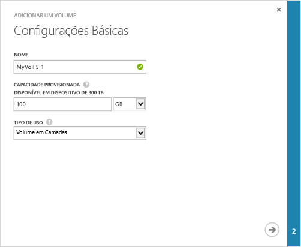
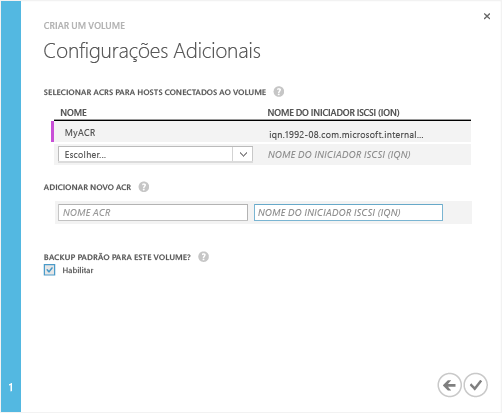

<!--author=SharS last changed: 9/17/15-->

#### Para criar um volume

1. No página **Início Rápido** do dispositivo clique em **Adicionar um volume**. Isso inicia o assistente Adicionar um volume.

2. No assistente Adicionar um volume, em **Configurações Básicas**:
   1. Digite uma **Nome** para o seu volume.
   2. Especifique o **Capacidade Provisionada** para o seu volume. **A capacidade do volume deve estar entre 1 GB e 64 TB.**
   3. Na lista suspensa, selecione o **Tipo de Uso** para o seu volume. Para dados de arquivamento acessados com menos frequência, selecione um **Volume de arquivamento**. Para todos os outros tipos de dados, selecione **Volume em camadas**. (Volumes em camadas eram chamados anteriormente de volumes primários).
   4. Clique no ícone de seta  para ir para a próxima página.

     

3. Na caixa de diálogo **Configurações Adicionais**, adicione um novo registro de controle de acesso (ACR):
   1. Dê um **Nome** para o seu ACR.
   2. Em **Nome do Iniciador iSCSI**, forneça o iSCSI IQN (nome qualificado) do host Windows. Se você não tiver o IQN, vá para [Obter o IQN de um host do Windows Server](#get-the-iqn-of-a-windows-server-host).
   3. Em **Backup padrão para este volume?**, selecione a caixa de seleção **Habilitar**. O backup padrão criará uma política que é executa às 22:30 todos os dias (hora do dispositivo) e cria um instantâneo de nuvem desse volume.

     >[AZURE.NOTE]Depois que o backup está habilitado aqui, ele não pode ser revertido. Você precisará editar o volume para modificar essa configuração.

     

4. Clique no ícone de verificação . Será criado um volume com as configurações especificadas.

 **Vídeo disponível**

Para assistir a um vídeo que demonstra como criar um volume do StorSimple, clique [aqui](http://azure.microsoft.com/documentation/videos/create-a-storsimple-volume/).

<!---HONumber=Sept15_HO3-->