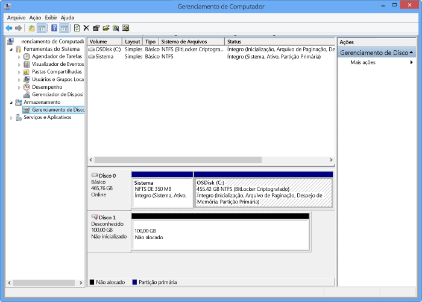

<!--author=SharS last changed: 9/17/15-->

#### Para montar, inicializar e formatar um volume

1. Inicie o iniciador iSCSI da Microsoft.

2. Na janela **Propriedades do Iniciador iSCSI** na guia **Descoberta**, clique em **Descobrir Portal**.

3. Na caixa de diálogo **Descobrir Portal de Destino**, forneça o endereço IP da sua interface de rede habilitada para iSCSI e clique em **OK**.

4. Na janela **Propriedades do Iniciador iSCSI** na guia **Destinos**, localize os **Destinos descobertos**. O status do dispositivo deve aparecer como **Inativo**.

5. Selecione o dispositivo de destino e depois clique em **Conectar**. Após o dispositivo ter sido conectado, o status deverá mudar para **Conectado**. (Para obter mais informações sobre o uso do iniciador iSCSI da Microsoft, consulte [Instalando e Configurando o Iniciador iSCSI da Microsoft][1]).

6. No host do Windows, aperte a tecla do logotipo do Windows + X e depois clique em **Executar**.

7. Na caixa de diálogo **Executar**, digite **Diskmgmt.msc**. Clique em **OK** e a caixa de diálogo **Gerenciamento de Disco** será exibida. O painel do lado direito exibirá os volumes do seu host.

8. Na janela **Gerenciamento de Disco**, os volumes montados serão exibidos conforme exibido na ilustração a seguir. Clique com o botão direito no volume descoberto (clique no nome do disco) e depois clique em **Online**.

     

9. Clique com o botão direito no volume descoberto (clique no nome do disco) e depois clique em **Inicializar**.

10. Para formatar um volume simples, realize as seguintes etapas:
  1. Selecione o volume, clique com o botão direito no mesmo (clique na área do lado direito) e clique em **Novo Volume Simples**.
  2. No assistente para Novo Volume Simples, especifique o tamanho do volume e a letra do drive e configure o volume como um sistema de arquivos NTFS.
  3. Especifique um tamanho de unidade de alocação com 64 KB. Esse tamanho de unidade de alocação funciona bem com os algoritmos de eliminação de duplicação usados na solução StorSimple.
  4. Realize uma formatação rápida.

 **Vídeo disponível**

Para assistir a um vídeo que demonstra como montar, inicializar e formatar um volume do StorSimple, clique [aqui](http://azure.microsoft.com/documentation/videos/mount-initialize-and-format-a-storsimple-volume/).

<!--Link references-->
[1]: https://technet.microsoft.com/library/ee338480(WS.10).aspx

<!---HONumber=Sept15_HO3-->