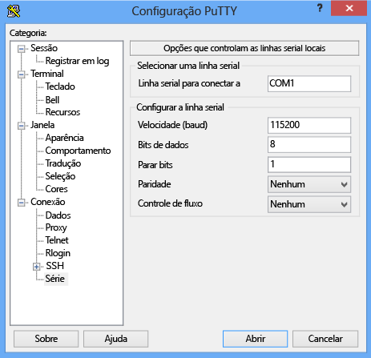

#### Para conectar-se por meio do console serial
1. Conecte o cabo serial ao dispositivo (diretamente ou por meio de um adaptador serial USB).
2. Abra o **Painel de Controle** e, em seguida, abra o **Gerenciador de Dispositivos**.
3. Identifique a porta COM como mostrado na ilustração a seguir.
   
     
4. Inicie o PuTTY. 
5. No painel à direita, altere o **Tipo de conexão** para **Serial**.
6. No painel à direita, digite a porta COM apropriada. Verifique se os parâmetros da configuração serial foram definidos da seguinte maneira:
   
   * Velocidade: 115.200
   * Bits de dados: 8
   * Bits de parada: 1
   * Paridade: Nenhum
   * Controle de fluxo: Nenhum
     
     Essas configurações são mostradas na ilustração a seguir.
     
      
     
     > [!NOTE]
     > Se a configuração de controle de fluxo padrão não funcionar, tente definir o controle de fluxo como XON/XOFF.
     > 
     > 
7. Clique em **Abrir** para iniciar uma sessão serial.

