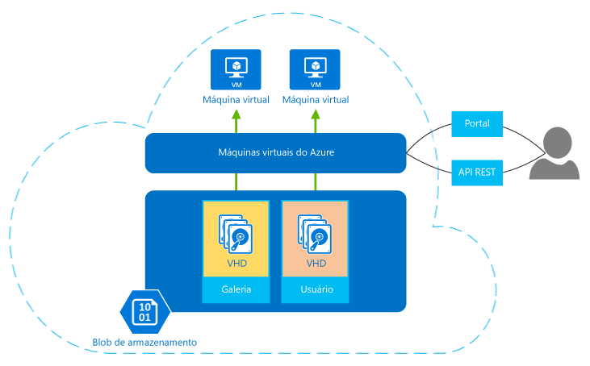

| Opções de computação | Público-alvo |
| ------------------ | --------   |
| [Serviço de Aplicativo] | Aplicativos Web escalonável, aplicativos móveis, aplicativos de API e lógica de aplicativos para qualquer dispositivo |
| [Serviços de Nuvem] | Aplicativos de nuvem de n camadas altamente disponíveis e escalonáveis com mais controle do sistema operacional |
| [Máquinas virtuais] | VMs do Windows e Linux com controle completo do sistema operacional personalizados |

## Fale sobre máquinas virtuais

Máquinas virtuais do Azure permitem criar e usar máquinas virtuais na nuvem. Fornecendo o que é conhecido como *Infraestrutura como Serviço (IaaS)*, essa tecnologia de máquina virtual pode ser usada de várias maneiras. Alguns exemplos incluem:

- **Máquinas virtuais (VMs) para desenvolvimento e teste.** Os grupos de desenvolvimento geralmente usam VMs porque eles oferecem uma maneira rápida e fácil para criar um computador com configurações específicas necessárias para testar o código e um aplicativo. As Máquinas Virtuais do Azure fornecem uma maneira direta e econômica de criar essas VMs, usá-las e removê-las quando elas não forem mais necessárias.
- **Aplicativos em execução na nuvem.** Faz sentido econômico executar alguns aplicativos na nuvem pública. Um exemplo é um aplicativo que tenha grandes picos de demanda. Embora você possa equipar seu próprio data center com hardware suficiente para lidar com picos de demanda, que possa ter o hardware subutilizado, grande parte do tempo. Executar esse aplicativo no Azure permite que você pague por VMs extras somente quando forem necessárias, desligando-as quando o pico de uma demanda tiver sido encerrado. Ou suponha que você seja um iniciante que precisa de recursos de computação sob demanda rapidamente e sem comprometimento. Mais uma vez, o Azure pode ser a escolha certa.
- **Extensão do seu próprio datacenter para a nuvem pública.** Quando você usa a rede Virtual do Azure, sua organização pode criar uma rede virtual (VNET) que é uma extensão da sua própria rede local e adicionar VMs a esta VNET. Isso permite executar aplicativos como [SharePoint](../articles/virtual-machines/virtual-machines-windows-sharepoint-farm-structure.md), [SQL Server](../articles/virtual-machines/virtual-machines-windows-classic-sql-overview.md) e outros em uma VM do Azure. Essa abordagem pode ser mais fácil de implantar ou mais barata do que executá-los em VMs do seu próprio datacenter.   
- **Recuperação de desastre** Em vez de pagar continuamente por um datacenter de backup que raramente é usado, a recuperação de desastres com base na IaaS permite que você pague pelos recursos de computação necessários somente quando realmente precisar deles. Por exemplo, se seu datacenter primário falhar, você poderá criar VMs em execução no Azure para executar aplicativos essenciais e desligá-las quando não precisar mais delas.

Como outras máquinas virtuais, uma VM no Azure tem um sistema operacional, armazenamento e recursos de rede e pode executar uma ampla variedade de aplicativos. Você pode usar uma imagem fornecida pelo Azure ou um de seus parceiros ou usar seu próprio. Os exemplos incluem várias versões, edições e configurações de:
 
- Servidores Linux como Suse, Ubuntu e CentOS
- Windows Server 
- SQL Server
- BizTalk Server 
- SharePoint Server

As máquinas virtuais usam discos rígidos virtuais (VHDs) para armazenar seus dados e sistema operacional (SO). Os VHDs também são usados para as imagens que você pode optar por instalar um sistema operacional. A figura a seguir mostra isso, bem como duas das ferramentas para criar e gerenciar suas VMs.

 

**Figura: As Máquinas Virtuais do Azure fornecem a infraestrutura como serviço.**

As VMs podem ser gerenciadas usando um portal baseado em navegador, ferramentas de linha de comando com suporte para scripts ou diretamente por meio da API REST. Os parceiros da Microsoft, como a RightScale e a ScaleXtreme, também fornecem serviços de gerenciamento que dependem da API REST.

Juntamente com o sistema operacional, outras opções de configuração com VMs incluem:

- O tamanho, que determina a fatores como quantos discos que você pode anexar e a capacidade de processamento. O Azure oferece uma grande variedade de tamanhos para oferecer suporte a muitos tipos de usos. Para obter detalhes, consulte [Tamanhos das máquinas virtuais](../articles/virtual-machines/virtual-machines-linux-sizes.md).  
- A região do Azure onde sua nova VM será hospedada, como Estados Unidos, na Europa ou na Ásia. 
- Extensões da VM, que fornecem recursos adicionais a máquina virtual, como executar programas antivírus ou a utilização do recurso de configuração de estado desejado do Windows PowerShell.

Outros benefícios a serem consideradas para VMs:

**Pré-pago** – o Azure cobra um preço por hora com base no tamanho da VM e do sistema operacional. Para horas parciais, o Azure cobrará somente os minutos de uso. O armazenamento terá o preço e será cobrado separadamente. Para obter detalhes, consulte [preços de máquinas virtuais](https://azure.microsoft.com/pricing/details/virtual-machines/).

**Resiliência** – o Azure monitora o hardware físico que hospeda cada VM em execução. Se um servidor físico executando uma VM falhar, o Azure observa isso, a VM é movida para novo hardware e reinicia a VM. Esse processo é chamado, às vezes, recuperação de serviço. Azure também protege os dados de uma máquina virtual, mantendo cópias redundantes dos VHDs no armazenamento de blob.

<!---HONumber=AcomDC_0330_2016-->