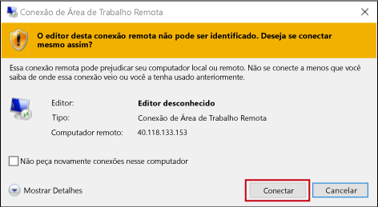
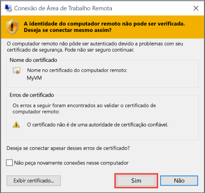

1. Clique no botão **Conectar** na página de propriedades da máquina virtual. 
2. Na página **Conectar à máquina virtual**, mantenha selecionadas as opções apropriadas e clique em **Fazer o download do arquivo RDP**.
2. Abra o arquivo RDP baixado e clique em **Conectar** quando solicitado. 
2. Você receberá um aviso de que o arquivo `.rdp` é proveniente de um editor desconhecido. Isso é normal. Na janela de Área de Trabalho Remota, clique em **Conectar** para continuar.

    
3. Na janela **Segurança do Windows**, selecione **Mais opções** e **Usar uma conta diferente**. Digite as credenciais de uma conta na máquina virtual e clique em **OK**.

     **Conta local** - normalmente, são o nome de usuário e a senha da conta local especificados por você no momento da criação da máquina virtual. Nesse caso, o domínio é o nome da máquina virtual e é inserido como *nomedavm*&#92;*nome de usuário*.  

    **VM Ingressada no Domínio** – se a VM pertencer a um domínio, digite o nome de usuário no formato *Domínio*&#92;*Nome de usuário*. A conta precisa estar no grupo Administradores ou ter privilégios de acesso remoto concedidos à VM.

    **Controlador de domínio** - se a VM for um controlador de domínio, digite o nome de usuário e a senha da conta de administrador para esse domínio.
4. Clique em **Sim** para verificar a identidade da máquina virtual e concluir o logon.

   
