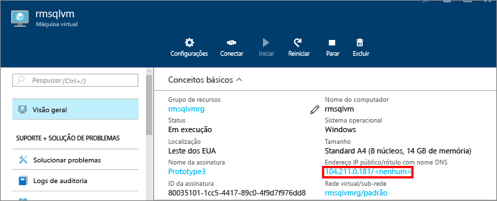
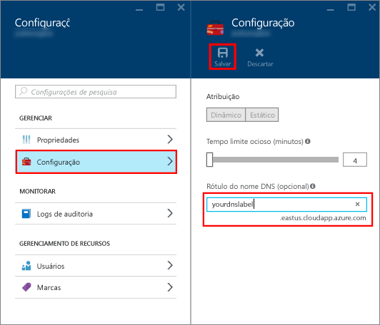
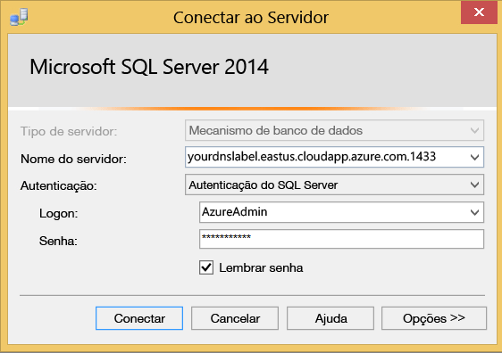

### Configurar um rótulo de DNS para o endereço IP público

Para conectar-se ao Mecanismo de Banco de Dados do SQL Server da Internet, primeiro configure um rótulo de DNS para o endereço IP público.

> [AZURE.NOTE] Rótulos de DNS não são obrigatórios se você planeja se conectar somente à instância do SQL Server na mesma Rede Virtual ou apenas localmente.

Para criar um rótulo de DNS, primeiro selecione **Máquinas Virtuais** no portal. Selecione sua VM do SQL Server para exibir suas propriedades.

1. Na folha de máquina virtual, selecione seu **Endereço IP Público.**

	

2. Nas propriedades de seu Endereço IP Público, expanda **Configuração**.

3. Insira um nome para o rótulo de DNS. Esse nome é um registro A que pode ser usado para se conectar à sua VM do SQL Server por nome em vez de por endereço IP diretamente.

	

### Conectar-se ao Mecanismo de Banco de Dados de outro computador

1. Em um computador conectado à Internet, abra o SSMS (SQL Server Management Studio).

2. Na caixa de diálogo **Conectar ao servidor** ou **Conectar ao Mecanismo de Banco de Dados**, edite o valor **Nome do servidor**. Digite o nome DNS completo da máquina virtual (definido na tarefa anterior).

3. Na caixa **Autenticação**, selecione **Autenticação do SQL Server**.

5. Na caixa **Logon**, digite o nome de um logon válido do SQL.

6. Na caixa **Senha**, digite a senha de logon.

7. Clique em **Conectar**.

	
