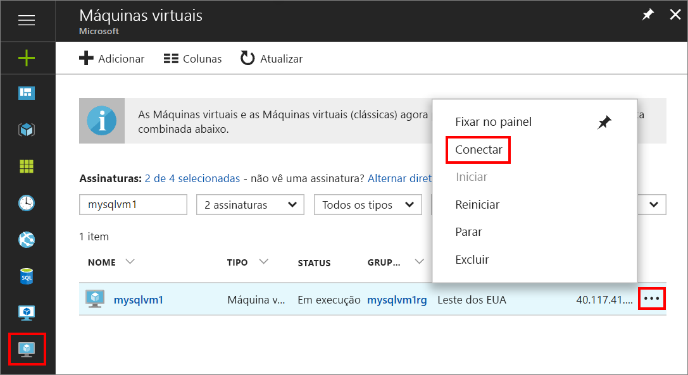
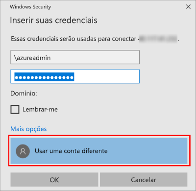

1. Após a criação e execução da máquina virtual do Azure, clique no ícone de Máquinas Virtuais no Portal do Azure para exibir suas VMs.

1. Clique nas reticências, **...** , da nova VM.

1. Clique em **Conectar**.

   

1. Abra o arquivo **RDP** baixado pelo seu navegador para a VM.

1. A Conexão de área de trabalho remota avisa você de que o distribuidor dessa conexão remota não pode ser identificado. Clique em **Conectar** para continuar.

1. Na caixa de diálogo **Segurança do Windows**, clique em **Usar uma conta diferente**. Talvez seja necessário clicar em **Mais opções** para vê-la. Especifique o nome de usuário e a senha configurados durante a criação da VM. Você deve adicionar uma barra invertida antes do nome de usuário.

   

1. Clique em **OK** para conectar.
