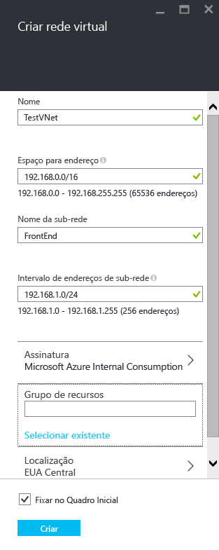
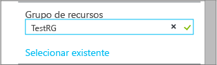
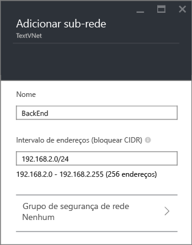
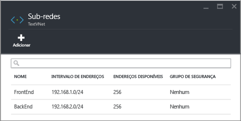

## Como criar uma rede virtual no portal do Azure
Para criar uma Rede Virtual com base no cenário anterior, usando o Portal de visualização do Azure, siga as etapas abaixo.

1. Em um navegador, navegue até http://portal.azure.com e, se necessário, entre com sua conta do Azure.
2. Clique em **NOVO** > **Rede** > **Rede virtual** e, em seguida, clique em **Resource Manager** na lista **Selecionar um modelo de implantação** e, em seguida, clique **Criar**, como mostrado na figura abaixo.
   
    
3. Na folha **Criar rede virtual** , defina as configurações de Rede Virtual, como mostrado na figura abaixo.
   
    
4. Clique em **Grupo de recursos** e selecione um grupo de recursos ao qual adicionar a Rede Virtual ou clique em **Criar novo** para adicionar a Rede Virtual a um novo grupo de recursos. A figura a seguir mostra as configurações de um novo grupo de recursos denominado **TestRG**. Para saber mais sobre grupos de recursos, acesse [Visão geral do Azure Resource Manager](../articles/azure-resource-manager/resource-group-overview.md#resource-groups).
   
    
5. Se necessário, altere as configurações de **Assinatura** e **Local** da sua rede virtual. 
6. Se não deseja ver a rede virtual como um bloco no **Quadro Inicial**, desabilite **Fixar no Quadro Inicial**. 
7. Clique em **Criar** e observe o bloco chamado **Criando a rede virtual**, conforme mostrado na figura abaixo.
   
    
8. Aguarde a criação da Rede Virtual e, na folha **Rede Virtual**, clique em **Todas as configurações** > **Sub-redes** > **Adicionar**, conforme mostrado abaixo.
   
    
9. Especifique as configurações de sub-rede para a sub-rede *back-end* , como mostrado abaixo e clique **OK**. 
   
    
10. Observe a lista de sub-redes, como mostrado na figura abaixo.
    
    

<!--HONumber=Nov16_HO2-->

