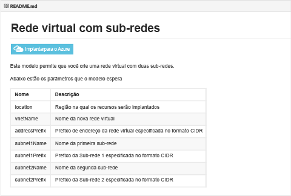
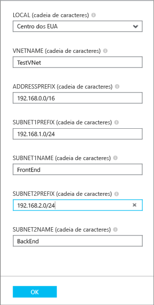

## Implantar o modelo ARM usando clique para implantar

Você pode reutilizar o carregamento de modelos ARM predefinidos para um repositório github mantido pela Microsoft e aberto para a comunidade. Esses modelos podem ser implantados diretamente do github ou descarregados e modificados para atender às suas necessidades. Para implantar um modelo que cria uma Rede Virtual com duas sub-redes, siga as etapas abaixo.

1. Em um navegador, navegue até [https://github.com/Azure/azure-quickstart-templates](https://github.com/Azure/azure-quickstart-templates).
2. Role para baixo na lista de modelos e clique em **101-vnet-two-subnets**. Verifique o arquivo **README.md**, como mostrado abaixo.

	

3. Clique em **Implantar no Azure**. Se necessário, insira suas credenciais de logon do Azure.
4. Na folha **Parâmetros**, insira os valores que você deseja usar para criar sua nova Rede Virtual e clique **OK**. A figura a seguir mostra os valores para o nosso cenário.

	

4. Clique em **Grupo de recursos** e selecione um grupo de recursos ao qual adicionar a Rede Virtual ou clique em **Criar novo** para adicionar a Rede Virtual a um novo grupo de recursos. A figura a seguir mostra as configurações de um novo grupo de recursos denominado **TestRG**.

	

5. Se necessário, altere as configurações de **Assinatura** e **Local** da sua rede virtual.
6. Se você não deseja ver a Rede Virtual como um bloco no **Quadro Inicial**, desabilite **Fixar no Quadro Inicial**.
5. Clique em **Termos legais**, leia os termos e clique em **Comprar** para concordar. 
6. Clique em **Criar** para criar a Rede Virtual.

	

7. Quando a implantação estiver concluída, clique em **TestVNet** > **Todas as configurações** > **Sub-redes** para ver as propriedades de sub-rede, como mostrado abaixo.

	

<!---HONumber=AcomDC_0323_2016-->