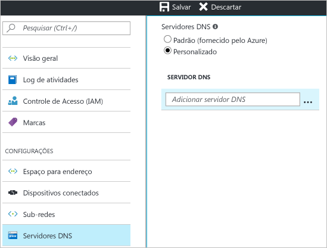

1. Na página **Configurações** de sua rede virtual, navegue até **Servidores DNS** e clique para abrir a folha de servidores DNS.
2. Na página **Servidores DNS**, em **Servidores DNS**, selecione **Personalizado**.
3. No campo **Servidor DNS**, na caixa **Adicionar servidor DNS**, insira o endereço IP do servidor DNS que você deseja usar para a resolução de nomes. Quando você terminar de adicionar servidores DNS, clique em **Salvar** na parte superior da folha para salvar sua configuração.

  