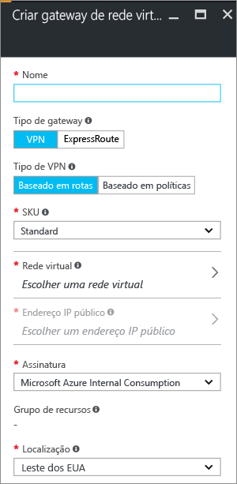

1. No portal, acesse **Novo**. Digite “Gateway de Rede Virtual” em pesquisa. Localize **Gateway de rede virtual** na pesquisa, retorne e clique na entrada. Isso abrirá a folha **Criar gateway de rede virtual**.
2. Clique em **Criar** na parte inferior da folha **Gateway de rede virtual**. A folha **Criar gateway de rede virtual** será aberta. Preencha os valores para seu gateway de rede virtual.

	

3. **Nome**: nomeie o seu gateway. Isso não é igual a nomear uma sub-rede de gateway. É o nome do objeto de gateway que você está criando.

4. **Tipo de gateway**: selecione **VPN**. Gateways VPN usam o tipo de gateway de rede virtual **VPN**.

5. **Tipo de VPN**: selecione o Tipo de VPN especificado para sua configuração. A maioria das configurações exige um tipo de VPN baseado em rota.

6. **SKU**: selecione o SKU de gateway no menu suspenso. As SKUs listadas na lista suspensa dependem do tipo de VPN selecionado.

7. **Local**: ajuste o campo **Local** para apontar para o local onde está sua rede virtual.
 
8. Escolha a rede virtual à qual você deseja adicionar este gateway. Clique em **Rede virtual** para abrir a folha **Escolher uma rede virtual**. Selecione a rede virtual. Se você não vir a sua rede virtual, verifique se o campo **Local** está apontando para a região na qual sua rede virtual está localizada.

9. Escolha um endereço IP público. Clique em **Endereço IP público** para abrir a folha **Escolher endereço IP público**. Clique em **+Criar Novo** para abrir a folha **Criar endereço IP público**. Dê um nome para o seu endereço IP público. Esta folha cria um objeto de endereço IP público para o qual um endereço IP público será atribuído dinamicamente. Clique em **OK** para salvar as alterações nessa folha.

10. **Assinatura**: verifique se a assinatura correta foi selecionada.

11. **Grupo de recursos**: essa configuração é determinada pela Rede virtual selecionada.

12. Não ajuste o **Local** depois de especificar as configurações acima.

13. Verifique as configurações. Você pode selecionar **Fixar no painel** na parte inferior da folha se quer que seu gateway apareça no painel.

14. Clique em **Criar** para começar a criar o gateway. As configurações serão validadas e você verá o bloco "Gateway de rede virtual implantado" no painel. A criação de um gateway pode levar até 45 minutos. Talvez seja necessário atualizar a página do portal para ver o status concluído.

	

11. Depois de criar o gateway você pode exibir, observando a Rede Virtual no portal, o endereço IP que foi atribuído a esse gateway. O gateway será exibido como um dispositivo conectado. Você pode clicar no dispositivo conectado (seu gateway de rede virtual) para exibir mais informações.

<!---HONumber=AcomDC_1005_2016-->