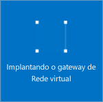

1. No portal, vá até **Novo** e, em seguida, **Rede**. Selecione **Gateway de rede virtual** da lista.

	

2. Na folha **Criar gateway de rede virtual**, no campo **Nome**, nomeie seu gateway. Isso não é igual a nomear uma sub-rede de gateway. Esse é o nome do objeto de gateway.
 
3. Em seguida, escolha a rede virtual na qual você deseja implantar este gateway. Clique na seta para abrir a folha **Escolher uma rede virtual** e, em seguida, clique em rede virtual. Para que a rede virtual apareça na lista, ela já deve ter uma sub-rede de gateway válida.

4. Escolha um endereço IP público. Clique na seta para abrir a folha **Escolher endereço IP público**. Depois, clique em **Criar Novo** para abrir a folha **Criar endereço IP público**. Dê um nome para o seu endereço IP público. Observe que isso não é o mesmo que pedir por um endereço IP. O endereço IP será atribuído dinamicamente. Em vez disso, esse é o nome do objeto de endereço IP ao qual o endereço será atribuído. Clique em **OK** para salvar as alterações.

5. Para **Tipo de Gateway**, selecione o Tipo de Gateway especificado para sua configuração.

6. Para **Tipo de VPN**, selecione o Tipo de VPN especificado para sua configuração.

7. Para **Assinatura**, verifique se a assinatura correta foi selecionada.

8. Para **Grupo de Recursos**, o grupo de recursos é determinado pela rede virtual selecionada.

9. Para **Local**, verifique se ele está mostrando o local em que existem ambos o seu Grupo de Recursos e sua Rede Virtual.

10. Você pode selecionar **Fixar no painel** se quiser que seu gateway apareça no painel. Clique em **Criar** para começar a criar o gateway. Você verá o bloco “Implantando gateway de rede virtual” no painel. A criação de um gateway pode levar até 45 minutos. Há muitas coisas acontecendo em segundo plano. Talvez seja necessário atualizar a página do portal para ver o status concluído.

	
	

11. Depois de criar o gateway você pode exibir, observando a Rede Virtual no portal, o endereço IP que foi atribuído a esse gateway. O gateway será exibido como um dispositivo conectado. Você pode clicar no dispositivo conectado (seu gateway de rede virtual) para exibir mais informações.

<!---HONumber=AcomDC_0406_2016-->