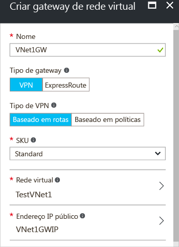

1. No lado esquerdo da página do portal, clique em **+** e digite 'Gateway de Rede Virtual' na pesquisa. Em **Resultados**, localize e clique em **Gateway de rede virtual**. Na parte inferior da folha **Gateway de rede virtual**, clique em **Criar**. Isso abrirá a folha **Criar gateway de rede virtual**.
2. Na folha **Criar gateway de rede virtual**, preencha os valores do seu gateway de rede virtual.

  
3. **Nome**: nomeie o seu gateway. Isso não é igual a nomear uma sub-rede de gateway. É o nome do objeto de gateway que você está criando.
4. **Tipo de gateway**: selecione **VPN**. Gateways VPN usam o tipo de gateway de rede virtual do tipo **VPN**. 
5. **Tipo de VPN**: selecione o Tipo de VPN especificado para sua configuração. A maioria das configurações exige um tipo de VPN baseado em rota.
6. **SKU**: selecione o SKU de gateway no menu suspenso. As SKUs listadas na lista suspensa dependem do tipo de VPN selecionado.
7. **Local**: talvez seja necessário rolar para ver o Local. Ajuste o campo **Local** para apontar para o local onde se encontra sua rede virtual. Se o local não estiver apontando para a região onde reside sua rede virtual, a rede virtual não aparecerá na lista suspensa 'Escolher uma rede virtual' da próxima etapa.
8. **Rede virtual**: escolha a rede virtual à qual você deseja adicionar este gateway. Clique em **Rede virtual** para abrir a folha **Escolher uma rede virtual**. Selecione a rede virtual. Se você não vir a sua rede virtual, verifique se o campo **Local** está apontando para a região na qual sua rede virtual está localizada.
9. **Criar endereço IP público**: Esta folha cria um objeto de endereço IP público ao qual um endereço IP público será atribuído dinamicamente. Clique em **Endereço IP público** para abrir a folha **Escolher endereço IP público**. Clique em **+Criar Novo** para abrir a folha **Criar endereço IP público**. Dê um nome para o seu endereço IP público. Clique em **OK** para salvar as alterações a essa folha. O endereço IP é atribuído dinamicamente quando o gateway de VPN é criado. O gateway de VPN atualmente suporta apenas alocação de endereços IP público *Dinâmico*. No entanto, isso não significa que o endereço IP é alterado depois que ele foi atribuído ao seu gateway de VPN. A única vez em que o endereço IP Público é alterado é quando o gateway é excluído e recriado. Isso não altera o redimensionamento, a redefinição ou outras manutenções/atualizações internas do seu gateway de VPN.

  
10. **Assinatura**: verifique se a assinatura correta foi selecionada.
11. **Grupo de recursos**: essa configuração é determinada pela Rede Virtual selecionada. 
12. Não ajuste o **Local** depois de especificar as configurações acima.
13. Verifique as configurações. Você pode selecionar **Fixar no painel** na parte inferior da folha se quer que seu gateway apareça no painel.
14. Clique em **Criar** para começar a criar o gateway. As configurações serão validadas e você verá o bloco "Gateway de rede virtual implantado" no painel. A criação de um gateway pode levar até 45 minutos. Talvez seja necessário atualizar a página do portal para ver o status concluído.
    
  
15. Depois de criar o gateway, exiba o endereço IP atribuído a ele observando a rede virtual no portal. O gateway será exibido como um dispositivo conectado. Você pode clicar no dispositivo conectado (seu gateway de rede virtual) para exibir mais informações.