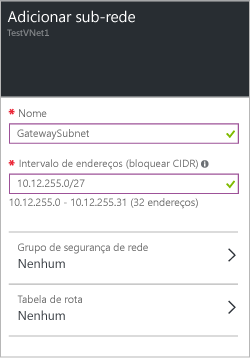

1. No portal, navegue até a rede virtual à qual deseja se conectar a um gateway.

2. Na seção **Configurações** da folha de sua rede virtual, clique em **Sub-redes** para expandir a folha Sub-redes.

3. Na folha **Sub-redes**, clique em **+Sub-rede de gateway** na parte superior. Isso abrirá a folha **Adicionar sub-rede**. O **nome** da sua sub-rede será automaticamente preenchido com o valor 'GatewaySubnet'. Esse valor é necessário para que o Azure reconheça a sub-rede como a sub-rede de gateway.

	

4. Você pode alterar o bloco CIDR do intervalo de endereço, se necessário. Verifique os requisitos específicos para que a configuração confirme o bloco CIDR recomendado.

5. Clique em **OK** na parte inferior da folha para criar a sub-rede.

<!----HONumber=AcomDC_0810_2016-->