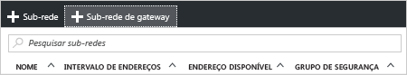
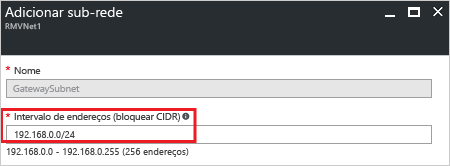

1. No [portal](http://portal.azure.com), navegue até a rede virtual do Gerenciador de Recursos para o qual você deseja criar um gateway de rede virtual.
2. Na seção **Configurações** da página VNet, clique em **Sub-redes** para expandir a página Sub-redes.
3. Na página **Sub-redes**, clique em **+Sub-rede de gateway** para abrir a página **Adicionar sub-rede**.

  
4. O **Nome** da sua sub-rede será automaticamente preenchido com o valor 'GatewaySubnet'. Esse valor é necessário para que o Azure reconheça a sub-rede como a sub-rede de gateway. Ajuste os valores **Intervalo de endereços** com preenchimento automático para corresponder aos seus requisitos de configuração, em seguida, clique em **OK** na parte inferior da página para criar a sub-rede.

  