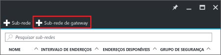
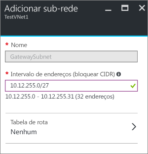

1. No portal, navegue até a rede virtual à qual deseja se conectar a um gateway.
2. Na seção **Configurações** da folha de sua rede virtual, clique em **Sub-redes** para expandir a folha Sub-redes.
3. Na folha **Sub-redes**, clique em **+Sub-rede de gateway** na parte superior. Isso abrirá a folha **Adicionar sub-rede** . 
   
    
4. O **nome** da sua sub-rede será automaticamente preenchido com o valor 'GatewaySubnet'. Esse valor é necessário para que o Azure reconheça a sub-rede como a sub-rede de gateway. Ajuste os valores preenchidos automaticamente de **Intervalo de endereços** para corresponder aos seus requisitos de configuração.
   
    
5. Clique em **OK** na parte inferior da folha para criar a sub-rede.

<!--HONumber=Nov16_HO2-->

