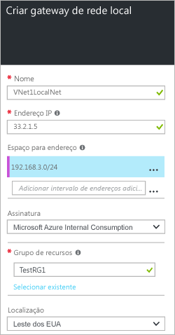

1. No portal, navegue até **Novo** > **Rede** > **Gateway de rede local**.

	

2. Na **folha Criar gateway de rede local**, especifique um **Nome** para seu objeto de gateway de rede local.
 
3. Especifique um **endereço IP** público válido para o dispositivo VPN ou gateway de rede virtual ao qual você deseja se conectar. Se essa rede local representa um local, esse é o endereço IP público do dispositivo VPN ao qual você deseja se conectar. Ele não pode estar por trás do NAT e deve poder ser acessado pelo Azure. Se essa rede local representa outra rede virtual, especifique o endereço IP público atribuído ao gateway de rede virtual para essa rede virtual. 

4. **Espaço de Endereço** refere-se aos intervalos de endereços para a rede que é representada por esse local. Você pode adicionar vários intervalos de espaço de endereço. Verifique se os intervalos que você especifica aqui não se sobrepõem aos intervalos de outras redes com que você deseja se conectar.
 
5. Para **Assinatura**, verifique se a assinatura correta está sendo exibida.

6. Para **Grupo de Recursos**, selecione o grupo de recursos que você deseja usar. Você pode criar um novo grupo de recursos ou selecionar um que você já criou.

7. Em **Local**, selecione o local em que esse objeto será criado. Você pode querer selecionar o mesmo local onde reside a sua rede virtual, mas não é necessário fazê-lo.

8. Clique em **Criar** para criar o gateway de rede local.

<!----HONumber=AcomDC_0810_2016-->