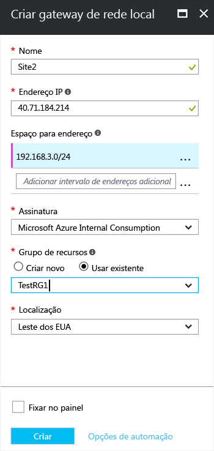

1. No portal, de **Todos os recursos**, clique em **+ Adicionar**. Na caixa de pesquisa da folha **Tudo**, digite **Gateway de rede local** e clique em pesquisar. Isso retornará uma lista. Clique em **Gateway de rede local** para abrir a folha, clique em **Criar** para abrir a falha **Criar gateway de rede local**.

      
2. Na **folha Criar gateway de rede local**, especifique um **Nome** para seu objeto de gateway de rede local.
3. Especifique um **endereço IP** público válido para o dispositivo VPN ou o gateway de rede virtual à qual você deseja se conectar. Este é o endereço IP público do dispositivo VPN que você deseja conectar. Ele não pode estar por trás do NAT e deve poder ser acessado pelo Azure. *Use seus próprios valores, não os valores mostrados na captura de tela*.
4. **Espaço de Endereço** refere-se aos intervalos de endereços para a rede que é representada por esse local. Você pode adicionar vários intervalos de espaço de endereço. Verifique se os intervalos que você especifica aqui não se sobrepõem aos intervalos de outras redes com que você deseja se conectar. O Azure roteará o intervalo de endereços especificado para o endereço IP do dispositivo VPN local. *Use seus próprios valores aqui, não os valores mostrados na captura de tela*.
5. Para **Assinatura**, verifique se a assinatura correta está sendo exibida.
6. Para **Grupo de Recursos**, selecione o grupo de recursos que você deseja usar. Você pode criar um novo grupo de recursos ou selecionar um que você já criou.
7. Em **Local**, selecione o local em que esse objeto será criado. Você pode querer selecionar o mesmo local onde reside a sua rede virtual, mas não é necessário fazê-lo.
8. Clique em **Criar** para criar o gateway de rede local.