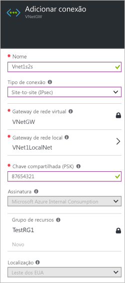
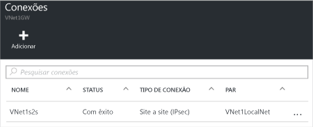

1. Localize seu gateway de rede virtual e clique em **Todas as configurações** para abrir a folha **Configurações**.

2. Na folha **Configurações**, clique em **Conexões** e, em seguida, clique em **Adicionar** na parte superior da folha para abrir a folha **Adicionar conexão**.

	

3. Na folha **Adicionar conexão**, dê um **Nome** para sua conexão.

4. Para **Tipo de Conexão**, selecione **Site a Site (IPsec)**

5. Para **Gateway de Rede Virtual**, o valor é fixo porque você está se conectando por esse gateway.

6. Para **Gateway de Rede Local**, clique em **Escolher um Gateway de Rede Local** e selecione o gateway de rede local que você deseja usar.

7. Para **Chave Compartilhada**, o valor aqui deve coincidir com o que você está usando para seu dispositivo VPN local. Se o seu dispositivo VPN na sua rede local não fornecer uma chave compartilhada, você pode compor uma e inseri-la aqui e em seus dispositivos locais. O importante é que ambos correspondam.

8. O restante dos valores para **Assinatura**, **Grupo de Recursos** e **Local** são fixos.

9. Clique em **OK** para criar sua conexão. Você verá *Criar Conexão* piscar na tela.

10. Quando a conexão for concluída, você a verá na folha **Conexões** do seu Gateway.

	

<!---HONumber=AcomDC_0406_2016-->