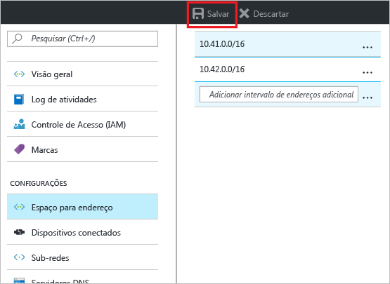
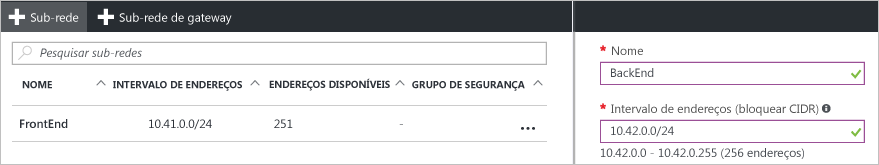

### Para adicionar o espaço de endereço
1. Para adicionar mais espaço de endereço, na seção **Configurações** da folha de rede virtual, clique em **Espaço de endereço** para abrir a folha de Espaço de endereço.
2. Adicione o espaço de endereço extra e clique em **Salvar** na parte superior da folha.
   
    

### Para criar sub-redes
1. Para criar sub-redes, na seção **Configurações** da folha de sua rede virtual, clique em **Sub-redes** para abrir a folha **Sub-redes**. 
2. Na folha Sub-redes, clique em **+Sub-rede** para abrir a folha **Adicionar sub-rede**. Nomeie a nova sub-rede e especifique o intervalo de endereços.
   
            
3. Clique em **OK** na parte inferior da folha para salvar suas alterações.
   
    

<!--HONumber=Nov16_HO2-->

