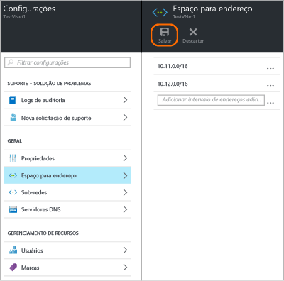
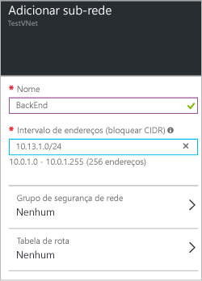

### Para adicionar o espaço de endereço

1. Para adicionar outro espaço de endereço, clique em **Todas as configurações** para abrir a folha **Configurações**. 

2. Na folha **Configurações**, clique em **Espaço de endereço** para abrir a folha de Espaço de endereço. Adicione o espaço de endereço adicional nessa folha e, em seguida, clique em **Salvar** na parte superior da folha.

	

### Para adicionar sub-redes 

1. Para adicionar as sub-redes adicionais a seus espaços de endereço, na folha **Configurações**, clique em **Sub-redes** para abrir a folha **Sub-redes**. 

2. Na folha Sub-redes, clique em **Adicionar** para abrir a folha **Adicionar sub-rede**. Nomeie sua nova sub-rede e especifique o intervalo de endereços. Em seguida, clique em **OK** na parte inferior da folha. Após a criação da sub-rede, você poderá usar a folha de sub-redes para exibir todas as suas sub-redes de uma rede virtual.

	

<!----HONumber=AcomDC_0406_2016-->