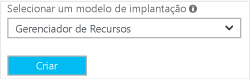
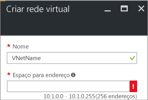
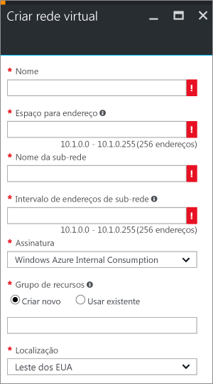
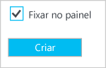
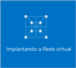

Para criar uma Rede Virtual no modelo de implantação do Gerenciador de Recursos usando o portal do Azure, siga as etapas abaixo. As capturas de tela são fornecidas como exemplos. Substitua os valores pelos seus próprios. Para saber mais sobre como trabalhar com as redes virtuais, consulte a [Visão Geral da Rede Virtual](../articles/virtual-network/virtual-networks-overview.md)

1. Em um navegador, navegue até o [portal do Azure](http://portal.azure.com) e, se necessário, entre com sua conta do Azure.
2. Clique em **Novo**. No campo **Pesquisar no marketplace**, digite "Rede Virtual". Localize **Rede Virtual** na lista retornada e clique para abrir a folha **Rede Virtual**.
   
    
3. Perto da parte inferior da folha Rede Virtual, na lista **Selecionar um modelo de implantação**, selecione **Gerenciador de Recursos** e clique em **Criar**.

    

1. Na folha **Criar rede virtual** , defina as configurações da VNet. Durante o preenchimento dos campos, o ponto de exclamação vermelho se tornará um ponto de seleção verde quando os caracteres digitados no campo forem válidos.
   
    
2. A folha **Criar rede virtual** é semelhante ao exemplo a seguir. Talvez alguns valores sejam preenchidos automaticamente. Se forem, substitua os valores pelos seus próprios.
   
    
3. **Nome**: insira o nome de sua Rede Virtual.
4. **Espaço de endereço**: insira o espaço de endereço. Se houver vários espaços de endereço para adicionar, adicione seu espaço de endereço primeiro. Você pode adicionar outros espaços de endereço posteriormente, depois de criar a rede virtual.
5. **Nome da sub-rede**: adicione o nome da sub-rede e o intervalo de endereços de sub-rede. Você pode adicionar outras sub-redes posteriormente, depois de criar a rede virtual.
6. **Assinatura**: verifique se a assinatura listada é a correta. Você pode alterar as assinaturas usando o menu suspenso.
7. **Grupo de recursos**: selecione um grupo de recursos existente ou crie um novo digitando um nome para seu novo grupo de recursos. Se você estiver criando um novo grupo, dê o nome do grupo de recursos de acordo com seus valores de configuração planejados. Para saber mais sobre grupos de recursos, visite [Visão geral do Gerenciador de Recursos do Azure](../articles/azure-resource-manager/resource-group-overview.md#resource-groups).
8. **Local**: selecione o local de sua rede virtual. O local determina onde ficarão os recursos que você implanta nessa rede virtual.
9. Selecione **Fixar no painel** se quiser ser capaz de encontrar sua VNet facilmente no painel, em seguida, clique em **Criar**.
   
   
10. Depois de clicar em **Criar**, você verá um bloco em seu painel refletir o progresso de sua rede virtual. O bloco muda à medida que a rede virtual é criada.
    
    

<!--HONumber=Nov16_HO2-->

