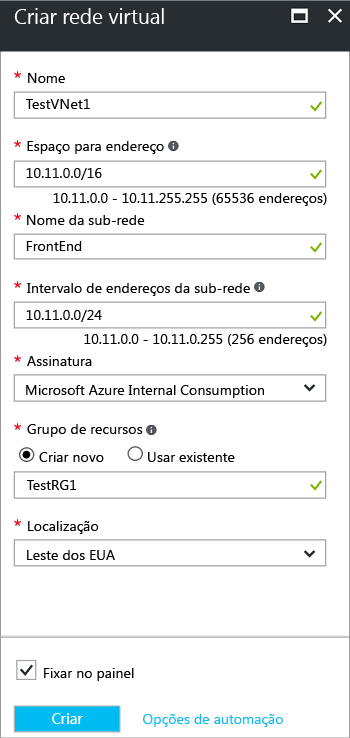

Para criar uma Rede Virtual no modelo de implantação do Gerenciador de Recursos usando o portal do Azure, siga as etapas abaixo. Use o [valores de exemplo](#values) se você estiver usando estas etapas como um tutorial. Se você não estiver executando estas etapas como um tutorial, substitua os valores pelos seus próprios. Para saber mais sobre como trabalhar com as redes virtuais, consulte a [Visão Geral da Rede Virtual](../articles/virtual-network/virtual-networks-overview.md)

1. Em um navegador, acesse o [Portal do Azure](http://portal.azure.com) e entre com sua conta do Azure.
2. Clique em **Novo**. No campo **Pesquisar no Marketplace**, digite "Rede Virtual". Localize **Rede Virtual** na lista retornada e clique para abrir a folha **Rede Virtual**.
3. Perto da parte inferior da folha Rede Virtual, na lista **Selecionar um modelo de implantação**, selecione **Gerenciador de Recursos** e clique em **Criar**. Isso abrirá a folha ‘Criar rede virtual’.

    
4. Na folha **Criar rede virtual** , defina as configurações da VNet. Durante o preenchimento dos campos, o ponto de exclamação vermelho se tornará um ponto de seleção verde quando os caracteres digitados no campo forem válidos.

  - **Nome**: insira o nome de sua rede virtual. Neste exemplo, usamos TestVNet1.
  - **Espaço de endereço**: insira o espaço de endereço. Se houver vários espaços de endereço para adicionar, adicione seu espaço de endereço primeiro. Você pode adicionar outros espaços de endereço posteriormente, depois de criar a rede virtual. Verifique se o espaço de endereço especificado não se sobrepõe ao espaço de endereço de sua localização.
  - **Nome da sub-rede**: adicione o primeiro nome da sub-rede e o intervalo de endereços de sub-rede. Você pode adicionar outras sub-redes e a sub-rede de gateway mais tarde, depois de criar essa rede virtual. 
  - **Assinatura**: verifique se a assinatura listada é a correta. Você pode alterar as assinaturas usando o menu suspenso.
  - **Grupo de recursos**: selecione um grupo de recursos existente ou crie um novo digitando um nome para seu novo grupo de recursos. Se você estiver criando um novo grupo, dê o nome do grupo de recursos de acordo com seus valores de configuração planejados. Para saber mais sobre grupos de recursos, visite [Visão geral do Gerenciador de Recursos do Azure](../articles/azure-resource-manager/resource-group-overview.md#resource-groups).
  - **Local**: selecione o local de sua rede virtual. O local determina onde ficarão os recursos que você implanta nessa rede virtual.

5. Selecione **Fixar no painel** se quiser encontrar sua VNet facilmente no painel. Em seguida, clique em **Criar**. Depois de clicar em **Criar**, você verá um bloco em seu painel refletir o progresso de sua rede virtual. O bloco muda à medida que a rede virtual é criada.