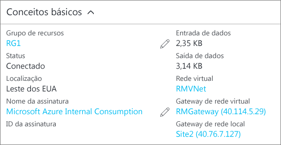

### Para verificar sua conexão usando o PowerShell
Você pode verificar se a conexão foi bem-sucedida usando o cmdlet `Get-AzureRmVirtualNetworkGatewayConnection` com ou sem `-Debug`. 

1. Use o seguinte exemplo de cmdlet, configurando os valores para coincidirem com os seus. Quando solicitado, selecione ‘A’ para executar ‘Todos’. No exemplo, `-Name` se refere ao nome da conexão que você criou e deseja testar.
   
        Get-AzureRmVirtualNetworkGatewayConnection -Name MyGWConnection -ResourceGroupName MyRG
2. Após o cmdlet ter sido concluído, exiba os valores. No exemplo abaixo, o status da conexão é exibido como ‘Conectado’ e é possível ver os bytes de entrada e saída.
   
        Body:
        {
          "name": "MyGWConnection",
          "id":
        "/subscriptions/086cfaa0-0d1d-4b1c-94544-f8e3da2a0c7789/resourceGroups/MyRG/providers/Microsoft.Network/connections/MyGWConnection",
          "properties": {
            "provisioningState": "Succeeded",
            "resourceGuid": "1c484f82-23ec-47e2-8cd8-231107450446b",
            "virtualNetworkGateway1": {
              "id":
        "/subscriptions/086cfaa0-0d1d-4b1c-94544-f8e3da2a0c7789/resourceGroups/MyRG/providers/Microsoft.Network/virtualNetworkGa
        teways/vnetgw1"
            },
            "localNetworkGateway2": {
              "id":
        "/subscriptions/086cfaa0-0d1d-4b1c-94544-f8e3da2a0c7789/resourceGroups/MyRG/providers/Microsoft.Network/localNetworkGate
        ways/LocalSite"
            },
            "connectionType": "IPsec",
            "routingWeight": 10,
            "sharedKey": "abc123",
            "connectionStatus": "Connected",
            "ingressBytesTransferred": 33509044,
            "egressBytesTransferred": 4142431
          }

### Para verificar sua conexão usando o portal do Azure
No portal do Azure, você pode exibir o status da conexão navegando para a conexão. Há várias maneiras de fazer isso. As etapas a seguir mostram uma maneira de navegar para a conexão e verificar.

1. No [portal do Azure](http://portal.azure.com), clique em **Todos os recursos** e navegue até o gateway de rede virtual.
2. Na folha do gateway de rede virtual, clique em **Conexões**. Você pode ver o status de cada conexão.
3. Clique no nome da conexão que você deseja verificar para abrir **Essentials**. No Essentials, você pode exibir mais informações sobre a conexão. O **Status** será 'Êxito' e 'Conectado' quando você tiver feito uma conexão bem-sucedida.
   
    

<!--HONumber=Oct16_HO2-->

